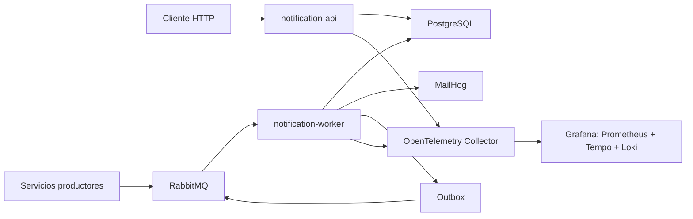

# Reconocimiento de notification-service

Evidencias de lectura, comprensión y ejecución local del microservicio `notification-service`, realizadas para la actividad de reconocimiento de la ficha 3145555.

## Objetivo

Comprender cómo el microservicio recibe solicitudes HTTP y eventos AMQP, entrega notificaciones por canales, persiste resultados, aplica plantillas, publica eventos mediante Outbox y exporta telemetría.

## Alcance y regla de trabajo

Este repositorio contiene exclusivamente documentación, capturas, diagramas, comandos reproducibles y propuestas de mejora. No contiene código fuente institucional, infraestructura, bases de datos, credenciales, archivos `.env` ni copias de los repositorios originales.

Durante la actividad el código fue leído y ejecutado sin modificaciones. El laboratorio se desplegó de forma local y aislada.

## Arquitectura reconocida

## Historias de usuario

| HU | Tema | Evidencia principal | Estado |
|---|---|---|---|
| [HU-001](hu-001/README.md) | Envío vía API | POST aceptado y validación de canal | Completa |
| [HU-002](hu-002/README.md) | Consumo AMQP | RabbitMQ → worker → MailHog → Outbox | Completa |
| [HU-003](hu-003/README.md) | Canales | Comparación EMAIL e IN_APP | Completa |
| [HU-004](hu-004/README.md) | Resiliencia | Fallos, ausencia de retry/DLQ e idempotencia parcial | Completa |
| [HU-005](hu-005/README.md) | Consulta | Respuestas HTTP 200, 404 y 400 | Completa |
| [HU-006](hu-006/README.md) | Plantillas | Renderizado, persistencia y fallback | Completa |
| [HU-007](hu-007/README.md) | Observabilidad | Health, Prometheus, Tempo y limitación de Loki | Completa |
| [HU-008](hu-008/README.md) | End-to-end local | Evento de horario hasta correo, Outbox y traza | Completa |

Cada HU incluye:

- Explicación en lenguaje propio.
- Capturas reales.
- Comandos reproducibles.
- Diagrama.
- Resultado observado.
- Mejora propuesta.

## Entorno local demostrado

| Componente | Acceso |
|---|---|
| API | `http://localhost:8080` |
| Worker health | `http://localhost:8081` |
| RabbitMQ UI | `http://localhost:15672` |
| MailHog | `http://localhost:18025` |
| Grafana | `http://localhost:3000` |
| PostgreSQL | Puerto local `15432` |

El laboratorio incluyó PostgreSQL, RabbitMQ, MailHog, OpenTelemetry Collector, Prometheus, Tempo, Loki y Grafana.

## Resultados destacados

- La API valida el contrato y persiste solicitudes en `PENDING`.
- El worker consume eventos de monitoreo y programación.
- EMAIL usa SMTP/MailHog; IN_APP depende de persistencia y consulta.
- El patrón Outbox guarda y publica `notification.notification.sent`.
- Las plantillas sustituyen variables y conservan `template_id`.
- Prometheus recibió métricas y Tempo recibió trazas con spans HTTP, PostgreSQL y AMQP.
- El recorrido end-to-end de horario produjo una notificación `SENT`, correo, Outbox publicado y traza de 12 spans.

## Hallazgos y mejoras prioritarias

1. Implementar reintentos limitados, backoff y DLQ.
2. Reservar `source_event_id` antes del envío externo para evitar correos duplicados.
3. Hacer que `SMTPNotifier` utilice `BodySummary` como cuerpo.
4. Unificar la entrega de solicitudes HTTP y eventos AMQP.
5. Validar códigos, canales y variables de plantillas.
6. Normalizar rutas métricas como `/notifications/{id}`.
7. Enviar logs a Loki mediante OTLP o un agente de stdout.
8. Añadir autenticación/autorización a la consulta por UUID.

## Material de sustentación

- [Presentación final para la sustentación](presentacion/README.md)

## Video

Enlace: **pendiente de grabación y publicación**.

El video debe mostrar el microservicio ejecutándose y el recorrido end-to-end documentado en la HU-008.
