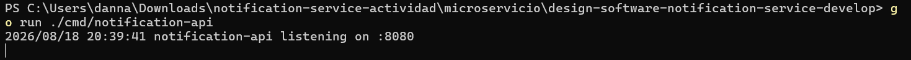
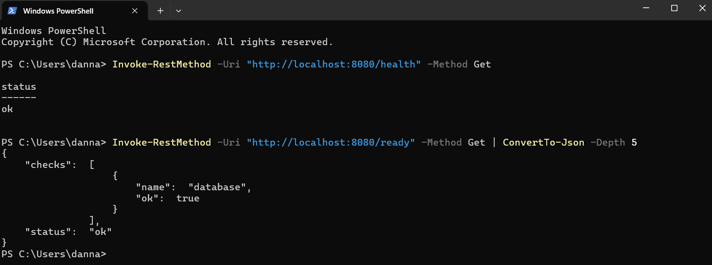
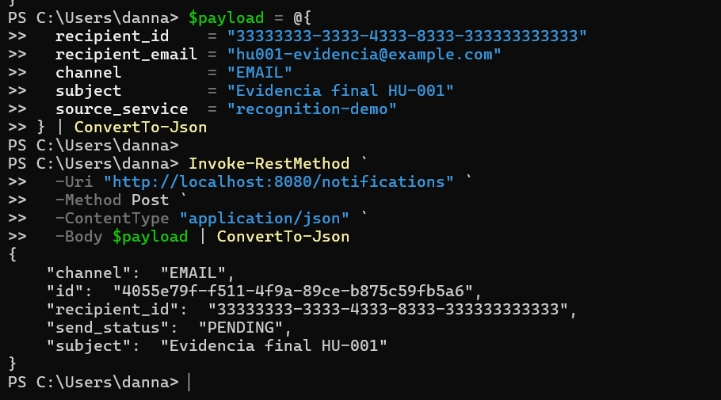
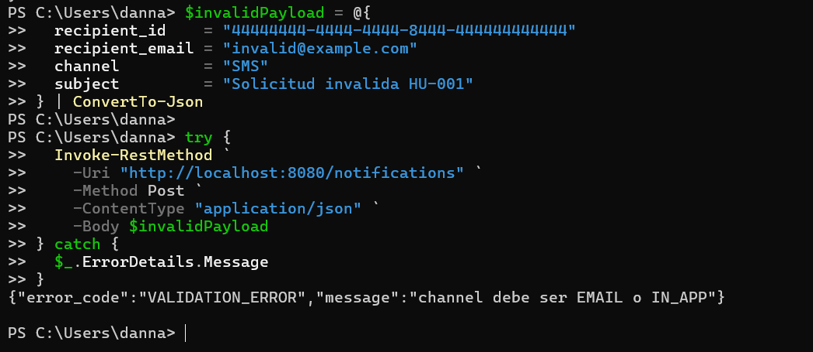

# HU-001 — Enviar notificación vía API

## Objetivo

Comprender y demostrar el ingreso de una solicitud de notificación mediante `POST /notifications`, desde la validación HTTP hasta su persistencia en PostgreSQL.

## Cómo entendí la HU

La API recibe los datos del destinatario, el canal y el asunto en formato JSON. El adaptador HTTP valida el contrato y transforma la solicitud en un comando de aplicación. El caso de uso construye una notificación con estado inicial `PENDING` y el repositorio la guarda en `notification.sent_notification`. Si todo sale bien, la API responde `202 Accepted` porque la solicitud fue aceptada para procesamiento.

Esta HU registra la intención de enviar la notificación. La entrega real por SMTP o IN_APP pertenece al flujo del worker y a las HU posteriores.

## Recorrido en el código

| Capa | Archivo y referencia | Responsabilidad |
|---|---|---|
| Contrato | `api/notification.gen.go` | DTO generado desde el contrato OpenAPI. |
| Adaptador HTTP | `internal/adapter/in/http/handler.go:75` | Registra las rutas HTTP. |
| Adaptador HTTP | `internal/adapter/in/http/handler.go:147` | Decodifica, valida y responde la solicitud. |
| Validación | `internal/adapter/in/http/handler.go:221` | Exige los campos requeridos y limita el canal a `EMAIL` o `IN_APP`. |
| Aplicación | `internal/application/usecase/send_notification.go:25` | Crea la entidad con estado inicial `PENDING`. |
| Persistencia | `internal/adapter/out/persistence/pg_repository.go:50` | Inserta la notificación en PostgreSQL. |

La dirección de dependencias observada es:

```text
HTTP → caso de uso → puerto de repositorio → PostgreSQL
```

## Entorno verificado

- API local: `http://localhost:8080`
- `GET /health`: `200 {"status":"ok"}`
- `GET /ready`: `200`, comprobación de base de datos correcta
- PostgreSQL: contenedor aislado, puerto local `15432`
- Pruebas unitarias generales: aprobadas con `go test ./...`

## Demostración positiva

Solicitud utilizada:

```json
{
  "recipient_id": "11111111-1111-4111-8111-111111111111",
  "recipient_email": "hu001-demo@example.com",
  "channel": "EMAIL",
  "subject": "Demostracion HU-001",
  "source_service": "recognition-demo"
}
```

Resultado HTTP:

```text
202 Accepted
id: 9da5a9f3-cb3e-47a2-b34a-7892e41cd034
channel: EMAIL
send_status: PENDING
subject: Demostracion HU-001
```

La consulta de verificación confirmó el mismo UUID en `notification.sent_notification`, con destinatario ficticio, canal `EMAIL`, estado `PENDING` y servicio de origen `recognition-demo`.

La ejecución reproducible realizada desde PowerShell generó además el UUID `4055e79f-f511-4f9a-89ce-b875c59fb5a6` con estado `PENDING`, confirmando que la demostración puede repetirse desde el equipo local.

## Demostración de validación

Se envió una solicitud con canal `SMS`, que no pertenece al contrato. La API respondió:

```json
{
  "error_code": "VALIDATION_ERROR",
  "message": "channel debe ser EMAIL o IN_APP"
}
```

Estado HTTP: `400 Bad Request`.

Esto demuestra que una solicitud inválida es rechazada antes de llegar al caso de uso y a la persistencia.

## Evidencias

- Diagrama: [`diagramas/flujo-hu-001.md`](diagramas/flujo-hu-001.md)
- Guía reproducible: [`comandos.md`](comandos.md)
- Video: se integrará en el video general de la actividad.

### 1. API iniciada



### 2. Liveness y readiness



### 3. Solicitud válida



### 4. Validación de canal



## Mejora propuesta

Incluir en la respuesta de error el `trace_id` activo. El contrato ya contempla ese campo, pero el método actual que construye errores no lo completa. Esto facilitaría correlacionar un error visto por el cliente con su traza y sus logs en Grafana/Tempo.

También conviene devolver explícitamente `Location: /notifications/{id}` en la respuesta `202`, para indicar al cliente dónde consultar posteriormente el estado de la notificación.

## Guion para la sustentación

> En la HU-001 el microservicio expone `POST /notifications`. El adaptador HTTP valida el contrato y permite únicamente EMAIL o IN_APP. Después delega al caso de uso, que crea la notificación en estado PENDING, y el repositorio la guarda en PostgreSQL. La respuesta es 202 porque la solicitud fue aceptada, pero la entrega todavía no es parte de este flujo. En la demostración envié una solicitud válida, comprobé el UUID en la base de datos y luego envié un canal SMS para evidenciar la validación con respuesta 400.
