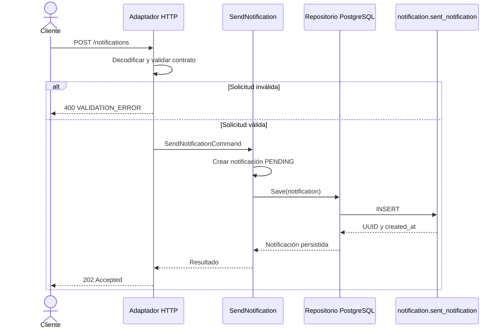

# Flujo de la HU-001

## Lectura del diagrama

La validación ocurre en el adaptador de entrada. El caso de uso no conoce HTTP y el dominio no depende de PostgreSQL. Esta separación refleja la arquitectura hexagonal del microservicio.

