# HU-002 — Consumir eventos AMQP

## Objetivo

Demostrar cómo `notification-worker` consume eventos desde RabbitMQ, entrega una notificación, guarda el resultado y publica un evento de salida mediante Outbox.

## Cómo entendí la HU

El worker escucha la cola `notification-service.events`. Los exchanges enrutan los eventos hacia ella según su routing key. En la prueba se publicó `monitoring.alert.triggered` con el identificador `55555555-5555-4555-8555-555555555555`.

RabbitMQ entregó el mensaje al consumidor activo. El worker resolvió al destinatario, cargó la plantilla `ALERT_TRIGGERED`, envió un correo SMTP, guardó la notificación como `SENT` y creó `notification.notification.sent` en Outbox. El relay publicó posteriormente ese evento de salida.

```text
Productor → exchange → routing key → cola → worker → PostgreSQL + Outbox → MailHog
```

## Componentes observados

| Componente | Responsabilidad |
|---|---|
| `monitoring-events` | Exchange que recibe eventos de monitoreo. |
| `monitoring.alert.triggered` | Routing key del evento probado. |
| `notification-service.events` | Cola consumida por el worker. |
| `notification-worker` | Procesa, entrega y persiste notificaciones. |
| `sent_notification` | Conserva el resultado de la entrega. |
| `outbox` | Guarda el evento de salida para publicarlo de forma confiable. |
| MailHog | Captura localmente los correos de prueba. |

## Resultado positivo

- RabbitMQ respondió `routed: true`.
- La cola mostró un consumidor activo y quedó con `Ready: 0`, `Unacked: 0`.
- El binding conectó `monitoring-events` mediante `monitoring.alert.triggered`.
- MailHog recibió `Alerta: LOW_ATTENDANCE` para `dev-notifications@sena.local`.
- PostgreSQL guardó una fila `EMAIL`, `SENT`, originada por `monitoring-service`.
- Outbox registró `notification.notification.sent` con `published_at` informado.

## Prueba de idempotencia y hallazgo

Se publicó nuevamente el mismo evento sin cambiar su `event_id`. PostgreSQL y Outbox conservaron una sola fila debido al índice único sobre `source_event_id`. Sin embargo, MailHog pasó de uno a dos correos.

La lectura del flujo mostró que `notifier.Send` se ejecuta antes de `SaveWithOutbox`. Por eso el segundo efecto externo ocurre antes de que PostgreSQL detecte el conflicto. La persistencia es idempotente, pero la entrega SMTP todavía no lo es.

## Evidencias

- [Comandos reproducibles](comandos.md)
- [Diagrama del flujo](diagramas/flujo-hu-002.md)
- Video: se integrará en el video general de la actividad.

### Ejecución y disponibilidad

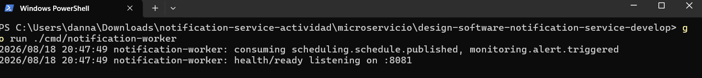

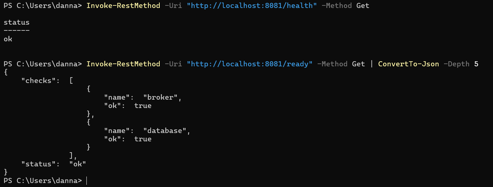

### RabbitMQ

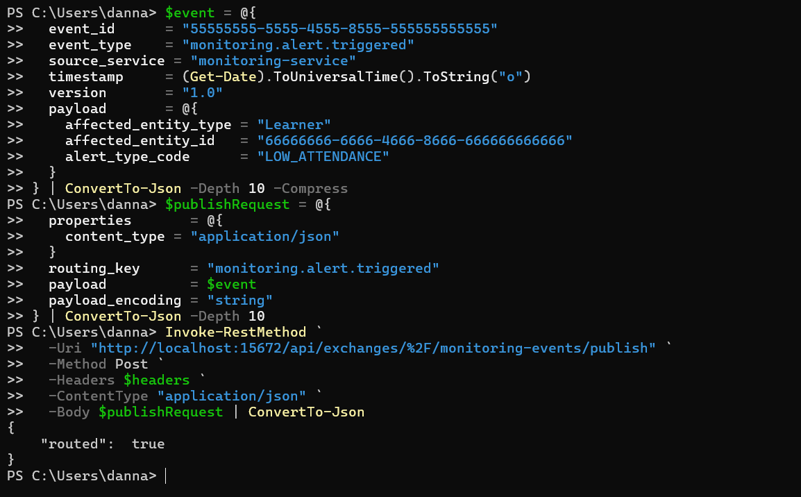

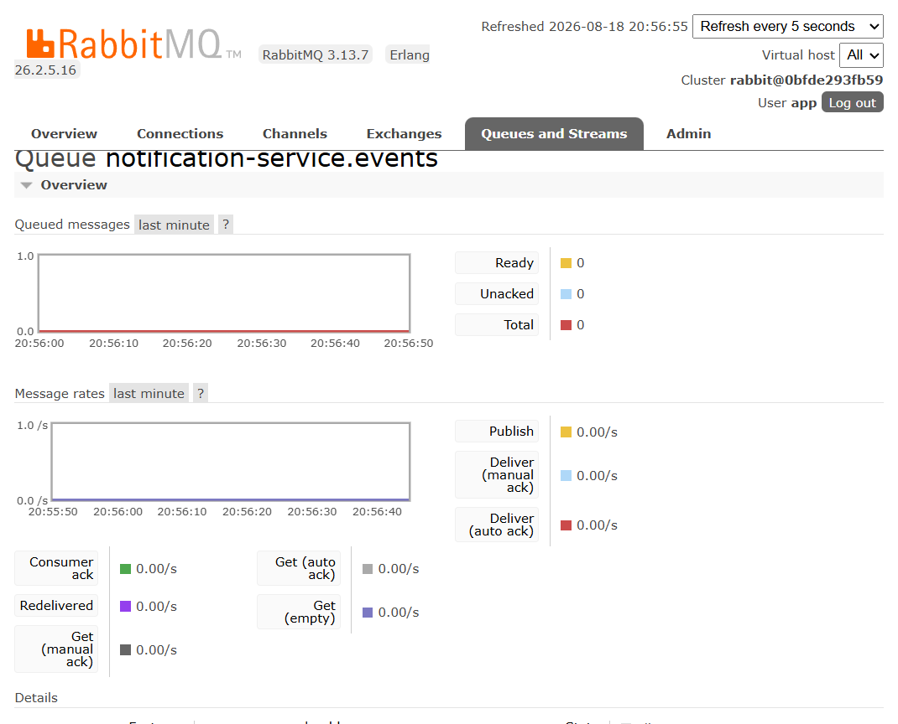

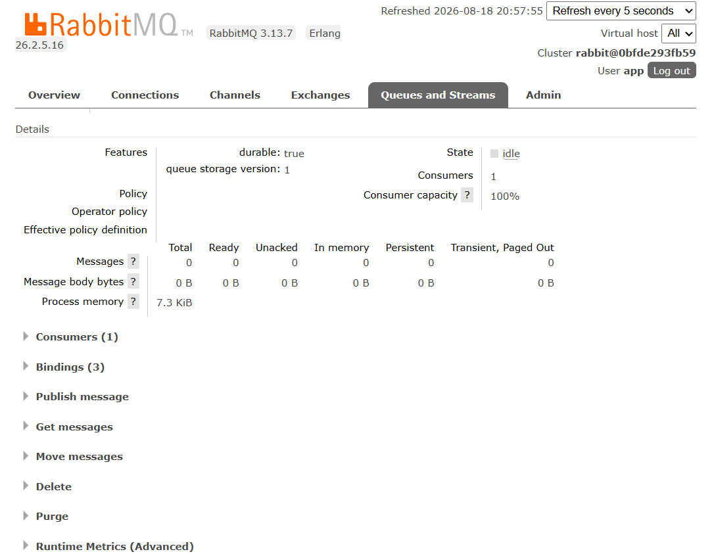

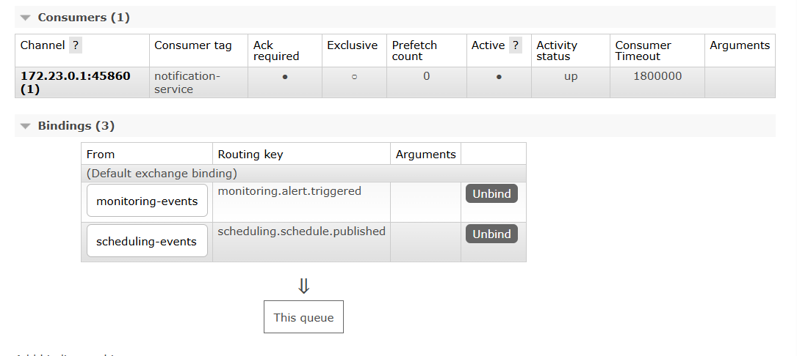

### Entrega y persistencia

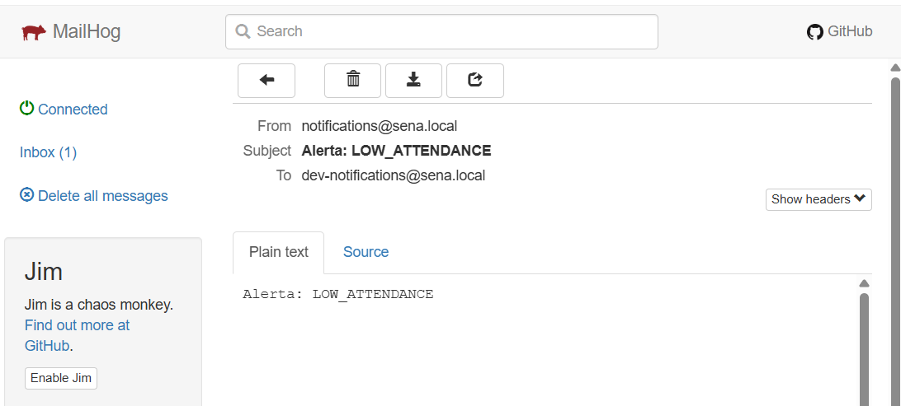

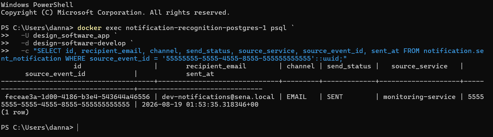

### Idempotencia y Outbox

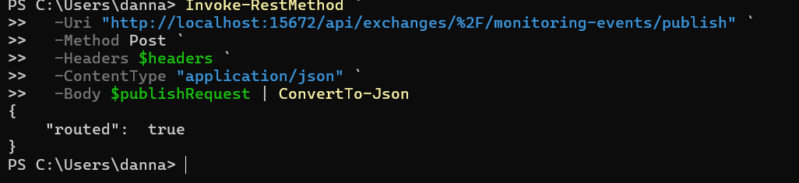

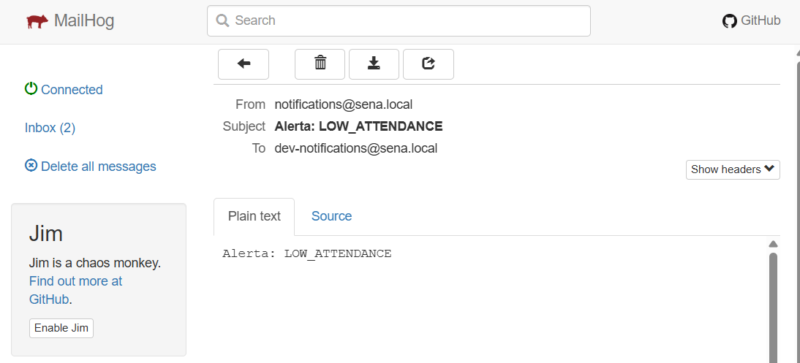

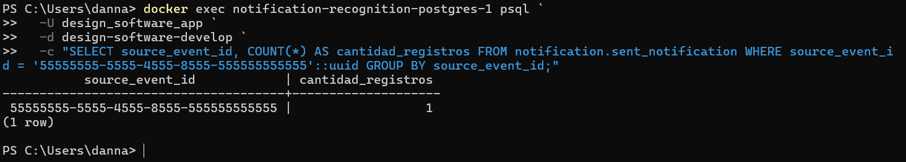

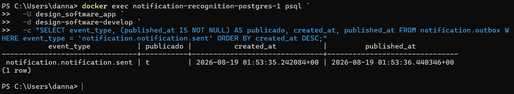

## Mejora propuesta

Reservar o consultar el `source_event_id` antes de ejecutar `notifier.Send`. Otra opción robusta es registrar primero una operación idempotente y delegar el envío a un procesador de entregas con clave única. Así una redelivery de RabbitMQ no genera un segundo correo.

También se recomienda emitir un log y una métrica cuando se descarte un evento duplicado.

## Guion para la sustentación

> En la HU-002 el worker consume eventos AMQP. Publiqué `monitoring.alert.triggered` en `monitoring-events`; RabbitMQ lo encaminó con su routing key a `notification-service.events`. El worker envió el correo a MailHog, guardó estado SENT y publicó el evento de salida mediante Outbox. Al repetir el mismo event_id, PostgreSQL y Outbox conservaron una sola fila, pero MailHog recibió dos correos. Esto demuestra idempotencia de persistencia, aunque no del efecto externo, y por eso propongo validar o reservar el identificador antes del envío.
