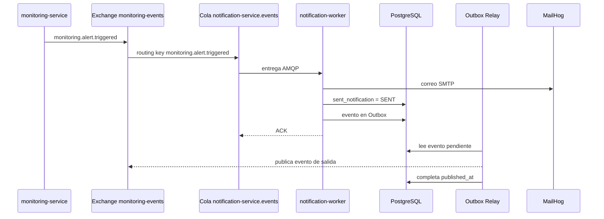
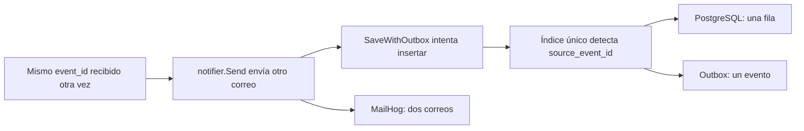

# Diagrama — HU-002

```mermaid
sequenceDiagram
    participant M as monitoring-service
    participant X as Exchange monitoring-events
    participant Q as Cola notification-service.events
    participant W as notification-worker
    participant DB as PostgreSQL
    participant O as Outbox Relay
    participant MH as MailHog

    M->>X: monitoring.alert.triggered
    X->>Q: routing key monitoring.alert.triggered
    Q->>W: entrega AMQP
    W->>MH: correo SMTP
    W->>DB: sent_notification = SENT
    W->>DB: evento en Outbox
    W-->>Q: ACK
    O->>DB: lee evento pendiente
    O-->>X: publica evento de salida
    O->>DB: completa published_at
```

## Evento repetido

```mermaid
flowchart LR
    A["Mismo event_id recibido otra vez"] --> B["notifier.Send envía otro correo"]
    B --> C["SaveWithOutbox intenta insertar"]
    C --> D["Índice único detecta source_event_id"]
    D --> E["PostgreSQL: una fila"]
    D --> F["Outbox: un evento"]
    B --> G["MailHog: dos correos"]
```

La protección evita duplicar la persistencia, pero ocurre después del envío externo.
