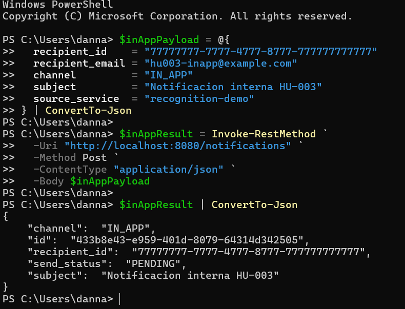
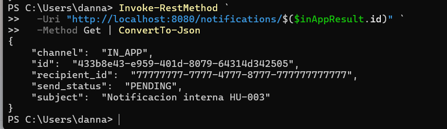
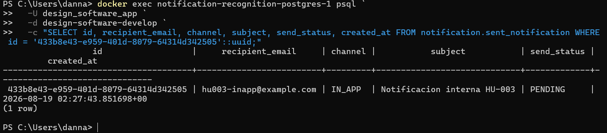
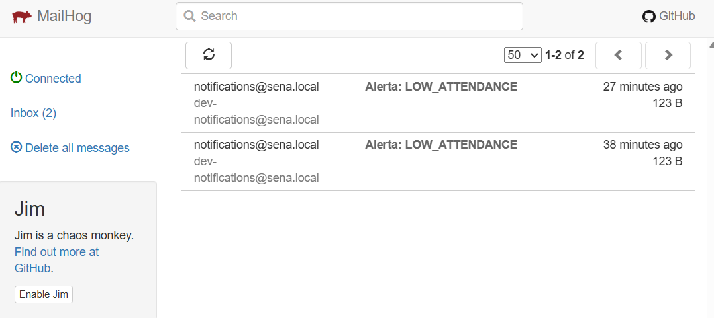

# HU-003 — Entrega por canales EMAIL e IN_APP

## Objetivo

Comprender cómo el microservicio selecciona el mecanismo de entrega según el canal y demostrar el comportamiento disponible para `EMAIL` e `IN_APP`.

## Cómo entendí la HU

`CompositeNotifier` funciona como selector de canal. Cuando recibe `EMAIL`, delega en `SMTPNotifier`, que construye un correo y lo entrega al relay SMTP local MailHog. Cuando recibe `IN_APP`, delega en `InAppNotifier`, que no llama a un proveedor externo: la fila persistida representa la notificación que posteriormente puede consultar la aplicación.

```text
CompositeNotifier
├── EMAIL  → SMTPNotifier → MailHog
└── IN_APP → InAppNotifier → persistencia y consulta
```

## Recorrido observado

| Componente | Responsabilidad |
|---|---|
| `CompositeNotifier` | Selecciona el adaptador mediante `n.Channel`. |
| `SMTPNotifier` | Envía `EMAIL` por SMTP. |
| `InAppNotifier` | No realiza un efecto externo; usa la persistencia existente. |
| `POST /notifications` | Valida `EMAIL` o `IN_APP` y registra la solicitud. |
| `GET /notifications/{id}` | Recupera la notificación persistida. |
| `sent_notification` | Conserva canal, asunto y estado. |

## Demostración de EMAIL

La HU-002 ya comprobó el canal `EMAIL` mediante un evento `monitoring.alert.triggered`: el worker seleccionó SMTP, MailHog recibió `Alerta: LOW_ATTENDANCE` y PostgreSQL guardó estado `SENT`.

## Demostración de IN_APP

Se envió a `POST /notifications` una solicitud con:

```json
{
  "recipient_id": "77777777-7777-4777-8777-777777777777",
  "recipient_email": "hu003-inapp@example.com",
  "channel": "IN_APP",
  "subject": "Notificación interna HU-003",
  "source_service": "recognition-demo"
}
```

La API respondió con el UUID `433b8e43-e959-401d-8079-64314d342505`, canal `IN_APP` y estado `PENDING`. El recurso pudo consultarse mediante `GET /notifications/{id}` y PostgreSQL confirmó una fila con los mismos datos.

Después de crearla, MailHog permaneció en `Inbox (2)`: no apareció un tercer correo. Esto confirma que `IN_APP` no utiliza SMTP.

## Hallazgo del comportamiento actual

El recorrido HTTP acepta y persiste `IN_APP`, pero no llama a `CompositeNotifier`; por eso la fila queda `PENDING`. El consumidor AMQP sí llama al notifier, pero en el código actual crea las notificaciones siempre con canal `EMAIL`.

En consecuencia, los adaptadores para ambos canales existen, pero no hay un recorrido end-to-end que entregue `IN_APP` y lo deje en `SENT`. Este resultado se documenta tal como fue observado, sin modificar el microservicio.

## Evidencias

- [Comandos reproducibles](comandos.md)
- [Diagrama de selección de canal](diagramas/canales-hu-003.md)
- Evidencia completa de EMAIL: [HU-002](../hu-002/README.md)
- Video: se integrará en el video general de la actividad.

### 1. Creación de IN_APP



### 2. Consulta mediante API



### 3. Persistencia



### 4. Ausencia de correo SMTP



## Mejora propuesta

Definir un único flujo de entrega para solicitudes HTTP y eventos AMQP. La API podría persistir una intención y publicar una tarea de entrega que el worker procese con `CompositeNotifier`. Además, la selección del canal para eventos debería provenir de una regla o preferencia del destinatario, en lugar de fijarse siempre en `EMAIL`.

Para `IN_APP`, el flujo debe actualizar explícitamente el estado a `SENT` cuando la notificación quede disponible para consulta. También conviene añadir pruebas unitarias específicas para `CompositeNotifier`, `SMTPNotifier` e `InAppNotifier`.

## Guion para la sustentación

> En la HU-003 estudié los canales EMAIL e IN_APP. CompositeNotifier decide qué adaptador usar. EMAIL usa SMTP y lo comprobé en MailHog durante la HU-002. IN_APP no envía correo: su representación es la fila persistida y consultable. Creé una solicitud IN_APP, recuperé su UUID por la API y confirmé la fila en PostgreSQL; MailHog no recibió un correo adicional. Encontré que este flujo permanece PENDING porque el POST no ejecuta CompositeNotifier, mientras que el worker fija EMAIL. Propongo unificar la entrega asíncrona y seleccionar el canal según la configuración del destinatario.
