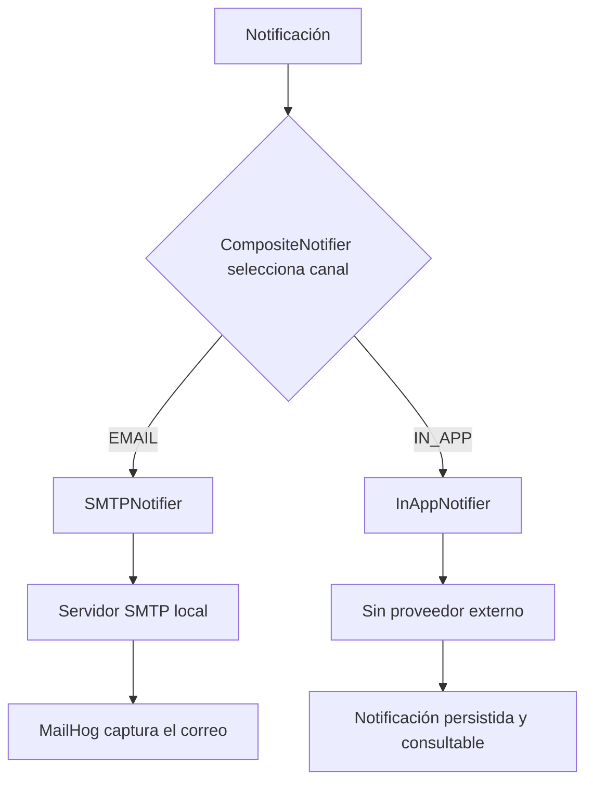
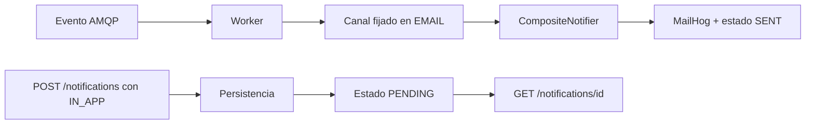

# Diagrama de canales — HU-003

```mermaid
flowchart TD
    A["Notificación"] --> B{"CompositeNotifier selecciona canal"}
    B -->|EMAIL| C["SMTPNotifier"]
    C --> D["Servidor SMTP local"]
    D --> E["MailHog captura el correo"]
    B -->|IN_APP| F["InAppNotifier"]
    F --> G["Sin proveedor externo"]
    G --> H["Notificación persistida y consultable"]
```

## Recorridos disponibles observados

```mermaid
flowchart LR
    A["Evento AMQP"] --> B["Worker"]
    B --> C["Canal fijado en EMAIL"]
    C --> D["CompositeNotifier"]
    D --> E["MailHog + estado SENT"]

    F["POST /notifications con IN_APP"] --> G["Persistencia"]
    G --> H["Estado PENDING"]
    H --> I["GET /notifications/id"]
```

El segundo recorrido demuestra registro y consulta, pero actualmente no atraviesa `CompositeNotifier`.
