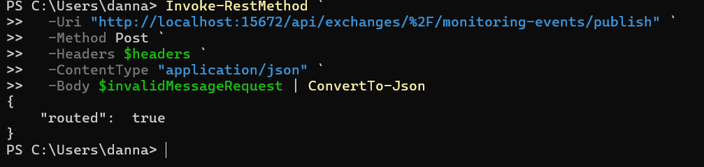
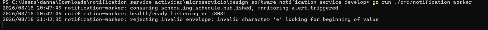
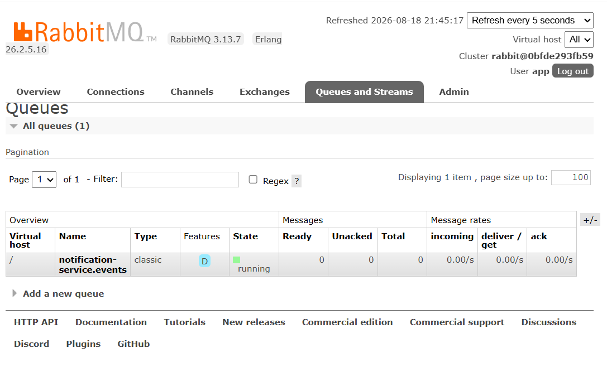
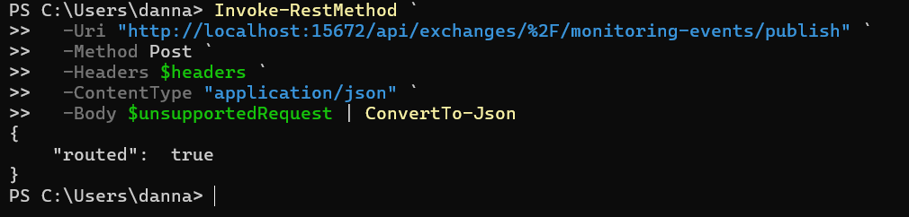
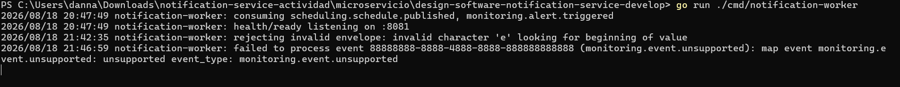
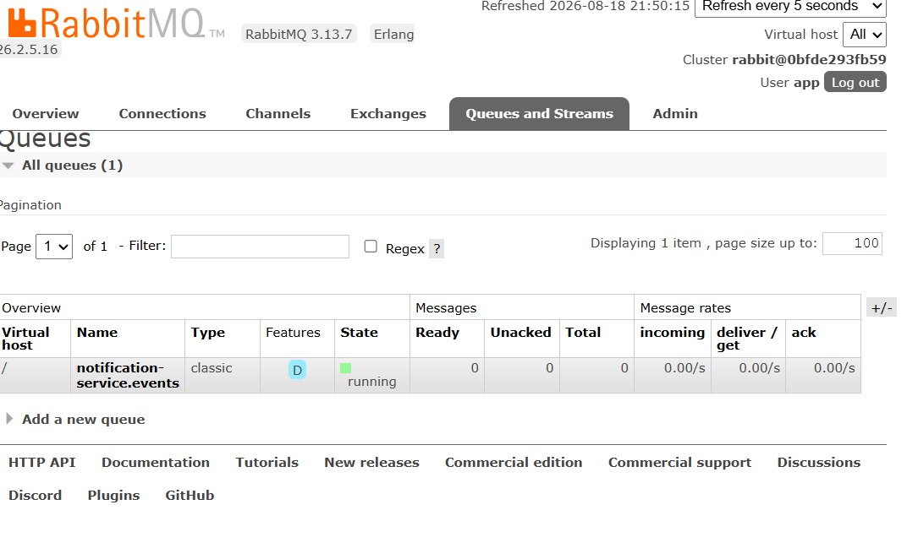

# HU-004 — Resiliencia, reintentos, DLQ e idempotencia

## Objetivo

Evaluar cómo responde el consumidor AMQP ante mensajes inválidos, errores de procesamiento y entregas repetidas, identificando las garantías existentes y las capacidades todavía pendientes.

## Cómo entendí la HU

Un consumidor resiliente no debe perder mensajes silenciosamente ni repetir efectos externos. Debe distinguir fallos transitorios de errores definitivos, aplicar reintentos limitados con backoff, enviar los mensajes agotados a una DLQ y procesar de forma idempotente.

La versión revisada mantiene vivo el worker después de un error y protege la persistencia mediante un índice único. Sin embargo, no configura reintentos, backoff ni DLQ, y la idempotencia no cubre completamente el envío SMTP.

## Comportamiento observado en el código

| Situación | Acción actual | Consecuencia |
|---|---|---|
| JSON inválido | `Nack(false, false)` | No se reencola y se descarta. |
| Error del caso de uso | Registra el error y ejecuta `Ack(false)` | RabbitMQ lo considera atendido y no lo reintenta. |
| Evento repetido | Índice único sobre `source_event_id` | No duplica `sent_notification` ni Outbox. |
| Correo repetido | `notifier.Send` ocurre antes de persistir | Puede duplicarse antes de detectar el conflicto. |

La cola `notification-service.events` no declara argumentos de dead-letter y no existe una cola DLQ.

## Prueba 1: formato inválido

Se publicó la cadena `esto-no-es-json` usando la routing key `monitoring.alert.triggered`. RabbitMQ respondió `routed: true`, pero el worker registró:

```text
rejecting invalid envelope: invalid character 'e' looking for beginning of value
```

Después, la cola quedó en `Ready: 0`, `Unacked: 0`, `Total: 0`. Como solo existía una cola, el mensaje no fue reintentado ni enviado a una DLQ.

## Prueba 2: evento no soportado

Se publicó un envelope JSON válido con `event_id` `88888888-8888-4888-8888-888888888888` y `event_type` `monitoring.event.unsupported`. RabbitMQ lo encaminó, pero el caso de uso respondió:

```text
unsupported event_type: monitoring.event.unsupported
```

El consumidor registró el error y después confirmó el mensaje. La cola volvió a cero y el worker continuó funcionando.

## Prueba 3: idempotencia

En la [HU-002](../hu-002/README.md) se publicó dos veces el mismo `event_id`. PostgreSQL conservó una fila y Outbox conservó un evento, pero MailHog recibió dos correos.

- [Publicación repetida](../hu-002/capturas/09-evento-repetido.png)
- [Dos correos en MailHog](../hu-002/capturas/10-dos-correos.png)
- [Una fila en PostgreSQL](../hu-002/capturas/11-idempotencia-base-datos.png)
- [Un evento Outbox](../hu-002/capturas/12-outbox-publicado.png)

Esto demuestra idempotencia de persistencia, pero no del efecto externo.

## Evidencias

- [Comandos reproducibles](comandos.md)
- [Diagrama actual y propuesta](diagramas/resiliencia-hu-004.md)
- Video: se integrará en el video general.

### Mensaje inválido







### Error de negocio







## Aspectos positivos

- El worker no se cae ante los dos errores probados.
- Los mensajes usan confirmación manual.
- PostgreSQL aplica una restricción única por evento.
- Notificación y Outbox se guardan en una transacción.
- Los errores quedan visibles en la salida del worker.

## Mejora propuesta

Implementar una política de reintentos limitada con backoff mediante colas de retry con TTL. Al agotar los intentos, los mensajes deben llegar a una DLQ con el motivo, contador de intentos y datos de correlación. Los errores permanentes de contrato pueden ir directamente a DLQ; los transitorios deben usar `NACK` y reintento.

Para garantizar idempotencia de extremo a extremo, debe reservarse el `source_event_id` antes de llamar a `notifier.Send`, o introducir una operación de entrega persistida con clave única. También se necesitan métricas para reintentos, descartes y profundidad de DLQ.

## Guion para la sustentación

> En la HU-004 probé dos fallos. Un cuerpo no JSON fue rechazado con NACK sin requeue; un envelope válido con event_type no soportado produjo un error del caso de uso y después fue confirmado con ACK. En ambos casos la cola quedó vacía y no existía DLQ, aunque el worker continuó activo. También reutilicé la prueba de idempotencia: PostgreSQL y Outbox no duplican filas, pero SMTP sí produjo dos correos porque el envío ocurre antes de comprobar el conflicto. Propongo reintentos limitados con backoff, DLQ y reserva del event_id antes de los efectos externos.
