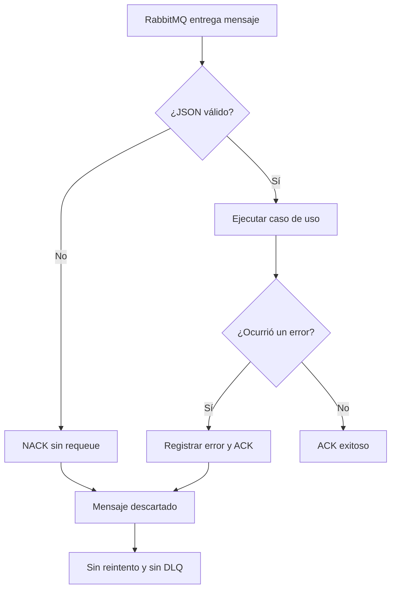
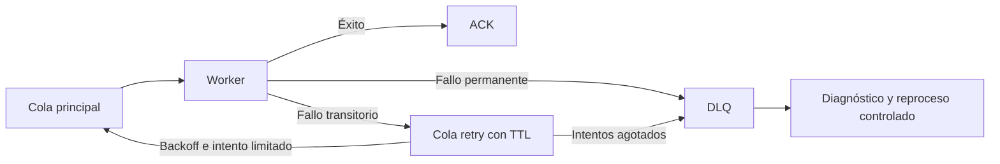
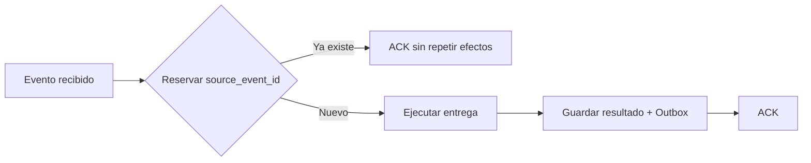

# Diagramas — HU-004

## Comportamiento actual

```mermaid
flowchart TD
    A["RabbitMQ entrega mensaje"] --> B{"¿JSON válido?"}
    B -->|No| C["NACK sin requeue"]
    C --> D["Mensaje descartado"]
    B -->|Sí| E["Ejecutar caso de uso"]
    E --> F{"¿Ocurrió un error?"}
    F -->|Sí| G["Registrar error y ACK"]
    G --> D
    F -->|No| H["ACK exitoso"]
    D --> I["Sin reintento y sin DLQ"]
```

## Arquitectura propuesta

```mermaid
flowchart LR
    A["Cola principal"] --> B["Worker"]
    B -->|Éxito| C["ACK"]
    B -->|Fallo transitorio| D["Cola retry con TTL"]
    D -->|Backoff e intento limitado| A
    B -->|Fallo permanente| E["DLQ"]
    D -->|Intentos agotados| E
    E --> F["Diagnóstico y reproceso controlado"]
```

## Idempotencia de extremo a extremo propuesta

```mermaid
flowchart LR
    A["Evento recibido"] --> B{"Reservar source_event_id"}
    B -->|Ya existe| C["ACK sin repetir efectos"]
    B -->|Nuevo| D["Ejecutar entrega"]
    D --> E["Guardar resultado + Outbox"]
    E --> F["ACK"]
```
