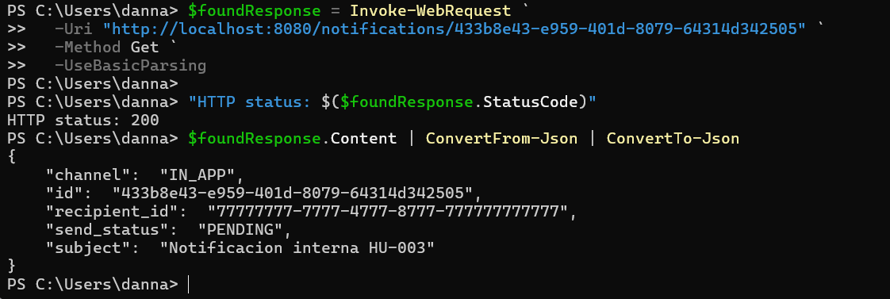
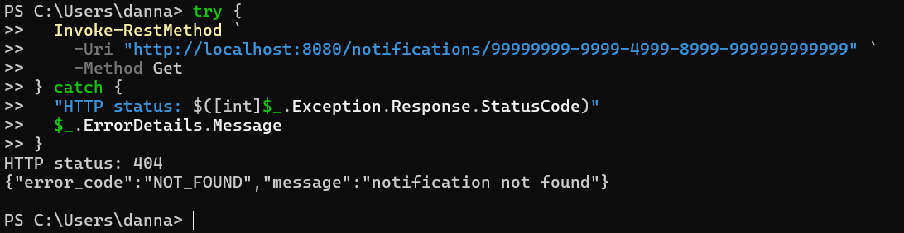
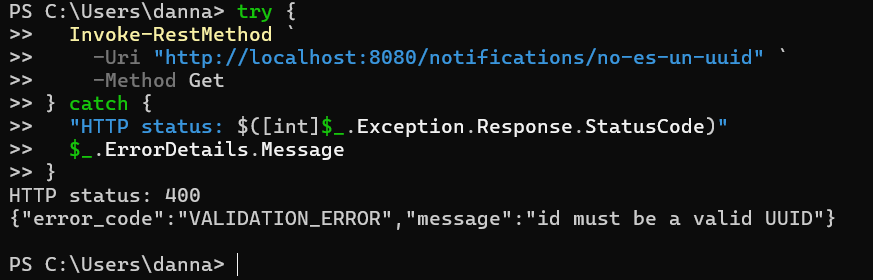

# HU-005 — Consultar notificaciones

## Objetivo

Comprender y demostrar la consulta de una notificación mediante `GET /notifications/{id}`, incluyendo las respuestas para un recurso existente, uno inexistente y un identificador inválido.

## Cómo entendí la HU

El cliente proporciona un UUID en la ruta. El adaptador HTTP valida primero su formato. Si es válido, el caso de uso `GetNotification` pide al repositorio buscarlo en `notification.sent_notification`. El resultado se transforma al contrato HTTP o se convierte en un error controlado.

```text
Cliente → validación UUID → GetNotification → FindByID → PostgreSQL
```

## Recorrido observado

| Componente | Responsabilidad |
|---|---|
| `GET /notifications/{id}` | Recibe el identificador en la URL. |
| Manejador HTTP | Valida el UUID y traduce errores a códigos HTTP. |
| `GetNotification` | Coordina la consulta y genera `ErrNotFound` si no existe. |
| `FindByID` | Ejecuta el `SELECT` en PostgreSQL. |
| `toSentNotification` | Construye la respuesta pública. |

## Casos demostrados

### 1. Notificación existente — 200

Se consultó `433b8e43-e959-401d-8079-64314d342505`, creado en la HU-003. La API respondió `200` con canal `IN_APP`, estado `PENDING`, destinatario y asunto correctos.

### 2. UUID válido inexistente — 404

Se consultó `99999999-9999-4999-8999-999999999999`. El formato pasó la validación, pero PostgreSQL no encontró una fila. La API respondió:

```json
{"error_code":"NOT_FOUND","message":"notification not found"}
```

### 3. Identificador inválido — 400

Se consultó `no-es-un-uuid`. El manejador lo rechazó antes de ejecutar el caso de uso:

```json
{"error_code":"VALIDATION_ERROR","message":"id must be a valid UUID"}
```

## Matriz de resultados

| Entrada | Estado HTTP | Capa que decide |
|---|---:|---|
| UUID existente | `200 OK` | Repositorio devuelve la fila. |
| UUID válido inexistente | `404 NOT_FOUND` | Caso de uso convierte ausencia en `ErrNotFound`. |
| Texto no UUID | `400 VALIDATION_ERROR` | Adaptador HTTP rechaza el formato. |

## Evidencias

- [Comandos reproducibles](comandos.md)
- [Diagrama de decisiones](diagramas/consulta-hu-005.md)
- Video: se integrará en el video general.

### Consulta exitosa



### Recurso inexistente



### UUID inválido



## Mejora propuesta

Incorporar autenticación y autorización para comprobar que quien consulta sea el destinatario o tenga permisos administrativos. Actualmente el endpoint no demuestra esa verificación, por lo que conocer un UUID podría ser suficiente para recuperar una notificación.

También se recomienda enviar `Cache-Control: no-store`, incluir `trace_id` en los errores y definir claramente qué campos del contenido puede exponer la respuesta.

No se interrumpió PostgreSQL para probar el error `503`, porque la actividad no autoriza afectar contenedores existentes.

## Guion para la sustentación

> En la HU-005 consulté notificaciones por UUID. El manejador valida el formato antes de acceder a datos. Con un UUID existente obtuve 200 y la notificación; con un UUID válido que no estaba en PostgreSQL obtuve 404 NOT_FOUND; y con un texto que no era UUID obtuve 400 VALIDATION_ERROR sin llegar al repositorio. Como mejora propongo autorización por destinatario, evitar caché y correlacionar errores con trace_id.
