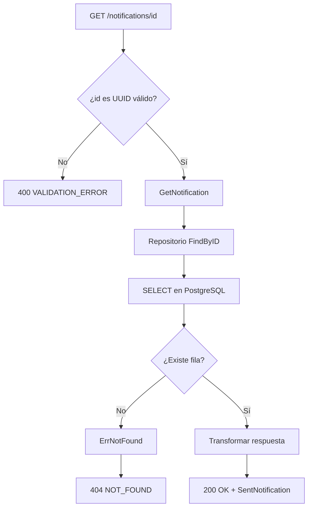
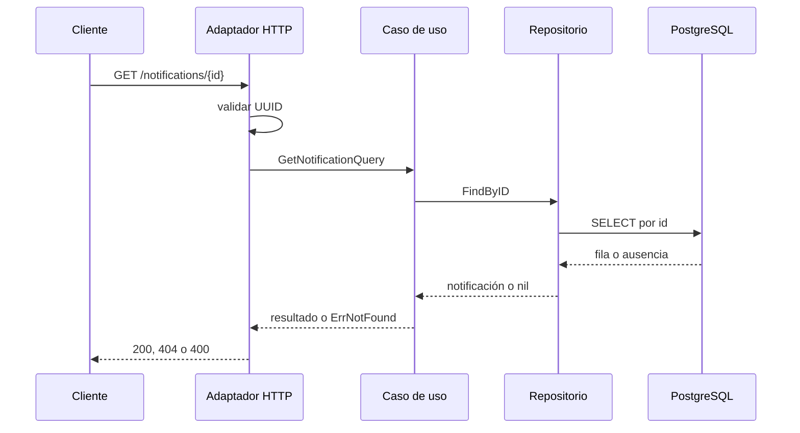

# Diagrama — HU-005

```mermaid
flowchart TD
    A["GET /notifications/id"] --> B{"¿id es UUID válido?"}
    B -->|No| C["400 VALIDATION_ERROR"]
    B -->|Sí| D["GetNotification"]
    D --> E["Repositorio FindByID"]
    E --> F["SELECT en PostgreSQL"]
    F --> G{"¿Existe fila?"}
    G -->|No| H["ErrNotFound"]
    H --> I["404 NOT_FOUND"]
    G -->|Sí| J["Transformar respuesta"]
    J --> K["200 OK + SentNotification"]
```

## Separación por capas

```mermaid
sequenceDiagram
    participant C as Cliente
    participant H as Adaptador HTTP
    participant U as Caso de uso
    participant R as Repositorio
    participant DB as PostgreSQL

    C->>H: GET /notifications/{id}
    H->>H: validar UUID
    H->>U: GetNotificationQuery
    U->>R: FindByID
    R->>DB: SELECT por id
    DB-->>R: fila o ausencia
    R-->>U: notificación o nil
    U-->>H: resultado o ErrNotFound
    H-->>C: 200, 404 o 400
```
