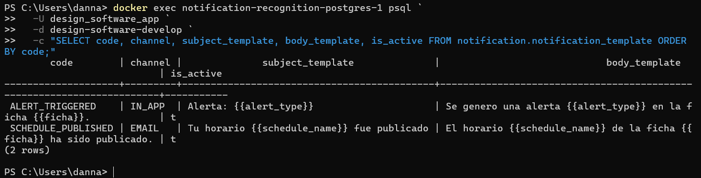
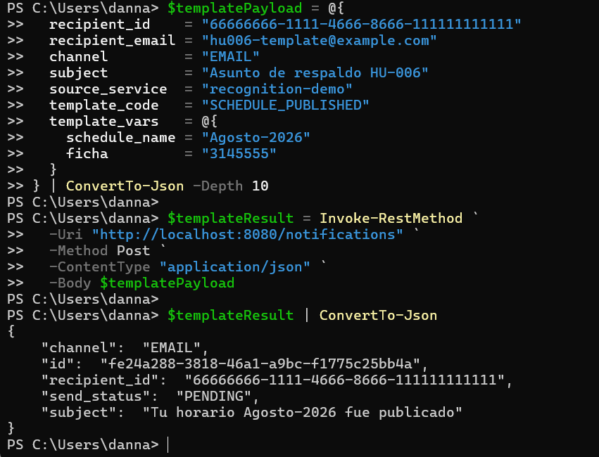
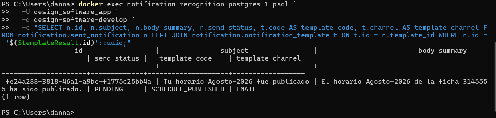
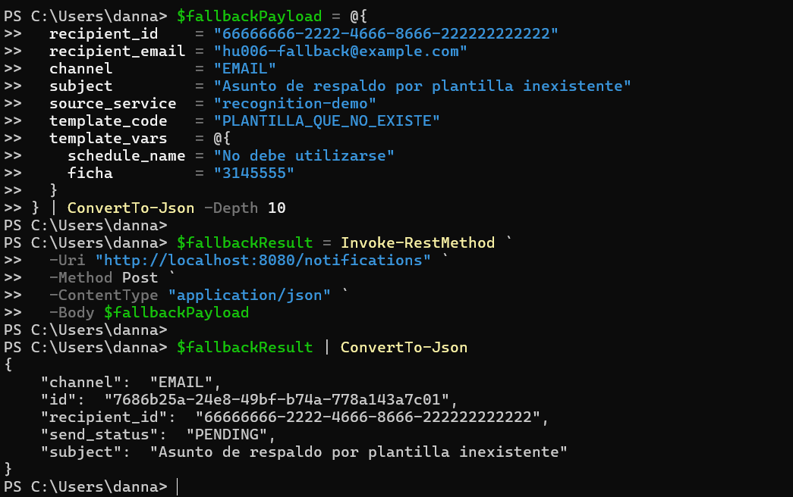
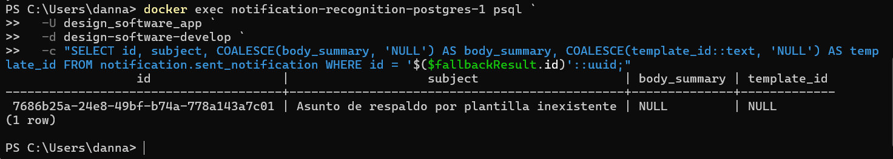
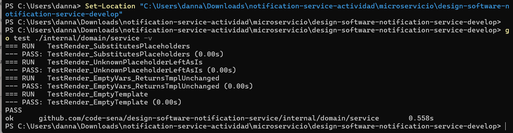

# HU-006 — Plantillas de notificación

## Objetivo

Comprender y demostrar cómo el microservicio selecciona una plantilla por código, sustituye variables y conserva la relación entre plantilla y notificación.

## Cómo entendí la HU

Las plantillas se almacenan en `notification.notification_template`. Cada una define código, canal, asunto, cuerpo y estado activo. El caso de uso busca la plantilla por código y el servicio `Render` reemplaza marcadores `{{clave}}` con valores recibidos en `template_vars`.

```text
template_code + template_vars
        ↓
buscar plantilla activa
        ↓
renderizar subject y body
        ↓
guardar template_id en la notificación
```

## Plantillas encontradas

| Código | Canal | Variables |
|---|---|---|
| `ALERT_TRIGGERED` | `IN_APP` | `alert_type`, `ficha` |
| `SCHEDULE_PUBLISHED` | `EMAIL` | `schedule_name`, `ficha` |

Ambas estaban activas. Los códigos son únicos en la base de datos.

## Recorrido observado

| Componente | Responsabilidad |
|---|---|
| `TemplateRepository.FindByCode` | Busca la plantilla en PostgreSQL. |
| `service.Render` | Sustituye todas las apariciones de `{{key}}`. |
| `SendNotification` | Aplica plantilla activa o conserva el asunto de respaldo. |
| `ConsumeDomainEvent` | Asocia tipos de evento con códigos y variables. |
| `sent_notification.template_id` | Registra qué plantilla fue utilizada. |

## Prueba positiva

Se creó una notificación `EMAIL` con:

```json
{
  "template_code": "SCHEDULE_PUBLISHED",
  "template_vars": {
    "schedule_name": "Agosto-2026",
    "ficha": "3145555"
  }
}
```

Aunque se envió `Asunto de respaldo HU-006`, la plantilla lo sustituyó por:

```text
Tu horario Agosto-2026 fue publicado
```

PostgreSQL confirmó el cuerpo:

```text
El horario Agosto-2026 de la ficha 3145555 ha sido publicado.
```

También guardó `template_code = SCHEDULE_PUBLISHED`, canal `EMAIL` y un `template_id` asociado.

## Prueba de fallback

Se envió `template_code = PLANTILLA_QUE_NO_EXISTE`. La API no devolvió error: conservó `Asunto de respaldo por plantilla inexistente`. PostgreSQL mostró `body_summary = NULL` y `template_id = NULL`.

Este fallback evita que falle la solicitud, pero oculta al cliente que el código era incorrecto.

## Pruebas unitarias

Las pruebas existentes del renderizador aprobaron:

- Sustitución de varios marcadores.
- Marcador desconocido que permanece visible.
- Variables vacías que dejan la plantilla intacta.
- Plantilla vacía.

## Evidencias

- [Comandos reproducibles](comandos.md)
- [Diagrama del renderizado](diagramas/plantillas-hu-006.md)
- Video: se integrará en el video general.

### Plantillas activas



### Renderizado exitoso





### Fallback





### Pruebas



## Hallazgos

- Un marcador sin variable permanece como `{{marcador}}`.
- Una plantilla inexistente no produce un error HTTP.
- El flujo no demuestra una validación entre el canal solicitado y el canal definido por la plantilla.
- El POST registra la notificación como `PENDING`; no realiza la entrega.

## Mejora propuesta

Validar antes de aceptar la solicitud que la plantilla exista, esté activa, coincida con el canal solicitado y reciba todas las variables requeridas. Ningún marcador sin resolver debe llegar al destinatario.

También conviene versionar las plantillas, registrar la versión usada en cada notificación y ofrecer una previsualización segura antes de activarlas.

## Guion para la sustentación

> En la HU-006 consulté las plantillas activas y utilicé SCHEDULE_PUBLISHED con las variables Agosto-2026 y ficha 3145555. La API reemplazó el asunto de respaldo y PostgreSQL confirmó el cuerpo renderizado y el template_id. Luego envié un código inexistente: el sistema conservó el asunto de respaldo y dejó body_summary y template_id en null. Finalmente ejecuté las pruebas del renderizador y todas pasaron. Propongo validar códigos, canal y variables para evitar fallbacks silenciosos o marcadores visibles.
