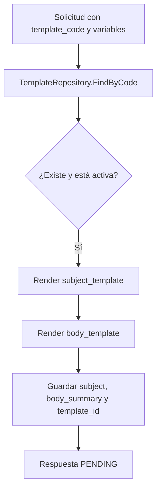
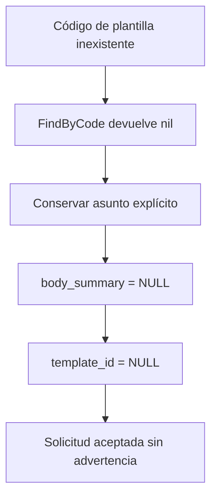

# Diagramas — HU-006

## Plantilla existente y activa



## Fallback observado



## Sustitución

```text
Tu horario {{schedule_name}} fue publicado
             + Agosto-2026
                         ↓
Tu horario Agosto-2026 fue publicado
```
