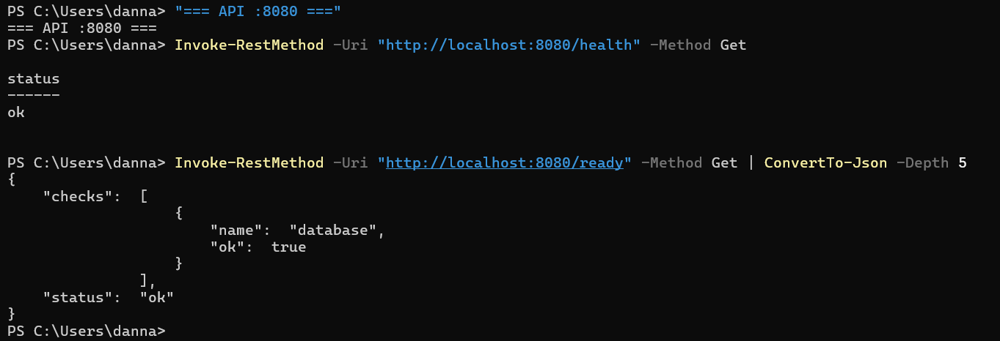
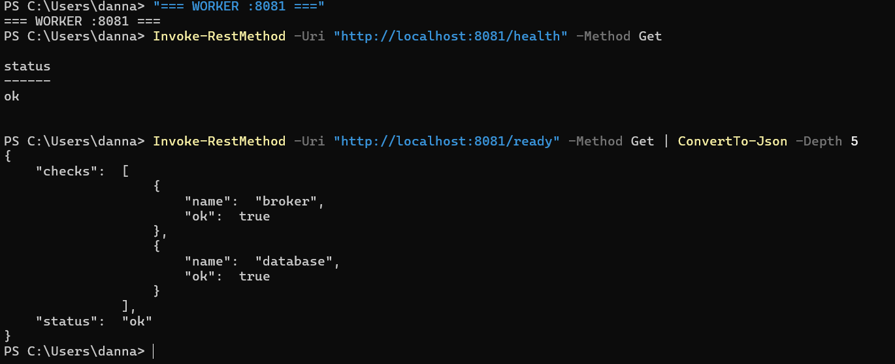
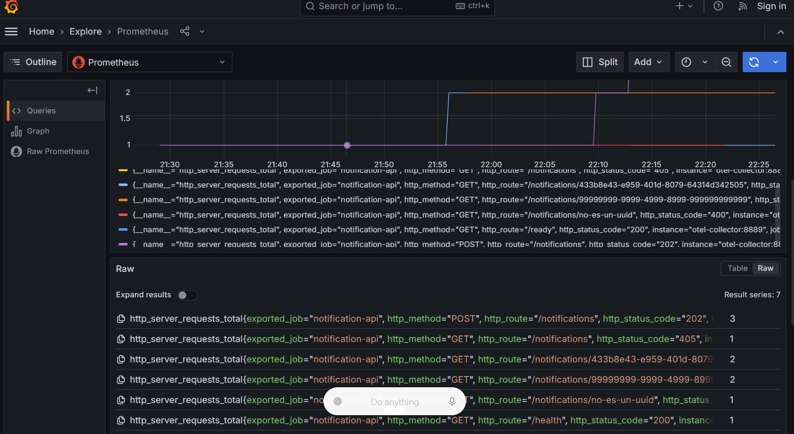
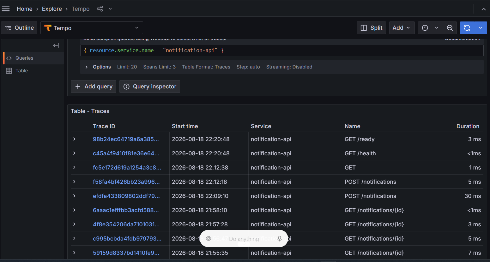
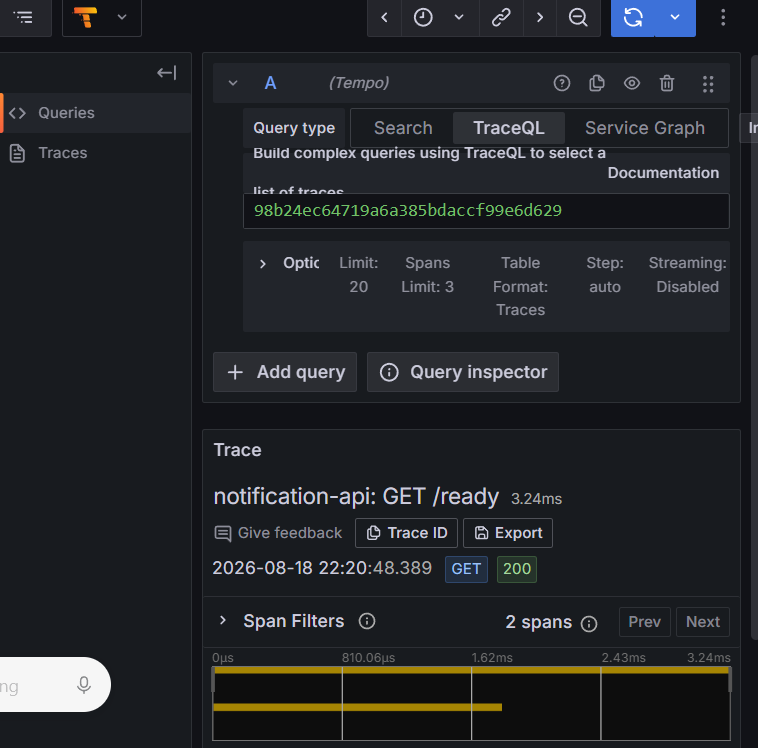
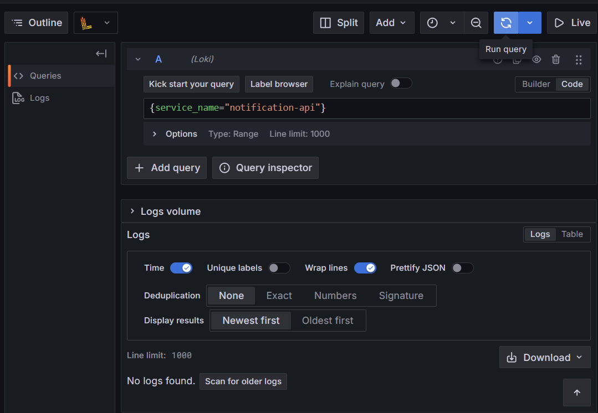

# HU-007 — Observabilidad OpenTelemetry y health

## Objetivo

Comprender y demostrar liveness, readiness, métricas, trazas y logs del microservicio, incluyendo las limitaciones reales del entorno local.

## Cómo entendí la HU

La observabilidad permite responder preguntas distintas:

| Pilar | Pregunta |
|---|---|
| Health | ¿El proceso está vivo? |
| Readiness | ¿Puede atender usando sus dependencias? |
| Métricas | ¿Cuánto ocurre y con qué rendimiento? |
| Trazas | ¿Qué recorrido siguió una solicitud? |
| Logs | ¿Qué detalle registró la aplicación? |

API y worker exportan métricas y trazas por OTLP/gRPC al OpenTelemetry Collector. El Collector expone métricas a Prometheus y envía trazas a Tempo. Grafana permite consultar Prometheus, Tempo y Loki.

## Arquitectura observada

```text
notification-api / notification-worker
                 ↓ OTLP :4317
        OpenTelemetry Collector
          ├── métricas → Prometheus
          ├── trazas   → Tempo
          └── logs     → Loki
                         ↓
                       Grafana
```

## Health y readiness

- API `/health`: `ok`.
- API `/ready`: PostgreSQL disponible.
- Worker `/health`: `ok`.
- Worker `/ready`: RabbitMQ y PostgreSQL disponibles.

`health` comprueba liveness. `ready` comprueba que el proceso puede trabajar con las dependencias necesarias.

## Métricas en Prometheus

La consulta:

```promql
http_server_requests_total
```

devolvió siete series del `notification-api`. Se observaron métodos `GET`/`POST`, estados `200`, `202`, `400`, `404` y `405`, además de rutas como `/health`, `/ready` y `/notifications`.

### Hallazgo de cardinalidad

Algunas etiquetas `http_route` contenían UUID completos, creando una serie distinta por identificador. Para las métricas debe utilizarse la ruta normalizada `/notifications/{id}`.

## Trazas en Tempo

La consulta TraceQL:

```traceql
{ resource.service.name = "notification-api" }
```

mostró trazas para `GET /health`, `GET /ready`, `POST /notifications` y `GET /notifications/{id}`. El detalle de `GET /ready` mostró estado `200`, duración de `3.24 ms` y dos spans: el servidor HTTP y la comprobación de PostgreSQL.

## Logs en Loki

La consulta LogQL:

```logql
{service_name="notification-api"}
```

para la última hora devolvió `No logs found`.

El código construye logs JSON y puede agregar `trace_id`/`span_id`, pero escribe a stdout. Los procesos se ejecutaron en PowerShell y no existe un agente que recoja ese stdout; tampoco se observó exportación de logs OTLP desde la aplicación. Loki está provisionado, pero no recibe estos logs locales.

## Instrumentación observada

- HTTP mediante `otelhttp`.
- PostgreSQL mediante `otelpgx`.
- AMQP consumer y Outbox publisher mediante spans manuales.
- Propagación W3C `traceparent` a través de AMQP y Outbox.
- Métricas RED: solicitudes y duración.
- Contador `notification.delivered` por canal y resultado.
- Logs JSON preparados para correlación con trazas.

## Evidencias

- [Comandos y consultas reproducibles](comandos.md)
- [Diagrama de observabilidad](diagramas/observabilidad-hu-007.md)
- Video: se integrará en el video general.

### Salud





### Métricas



### Trazas





### Logs



## Mejora propuesta

Exportar logs por OTLP o instalar un agente que recoja stdout de los procesos locales, preservando `trace_id` y `span_id` para correlacionar Loki con Tempo.

Normalizar `http_route` antes de registrar métricas, evitando UUID y otros valores variables. También conviene crear dashboards y alertas para tasa de errores, latencia, entregas fallidas, disponibilidad, reintentos y DLQ.

## Guion para la sustentación

> En la HU-007 comprobé health y readiness de API y worker. Prometheus recibió métricas HTTP con métodos y estados; allí encontré rutas con UUID que deberían normalizarse. Tempo recibió trazas y abrí GET /ready, que mostró dos spans y la comprobación de base de datos. Loki no mostró logs durante la última hora porque los procesos ejecutados en PowerShell escriben a stdout y no existe un recolector de ese origen. Propongo exportación OTLP de logs, correlación por trace_id y dashboards con alertas.
