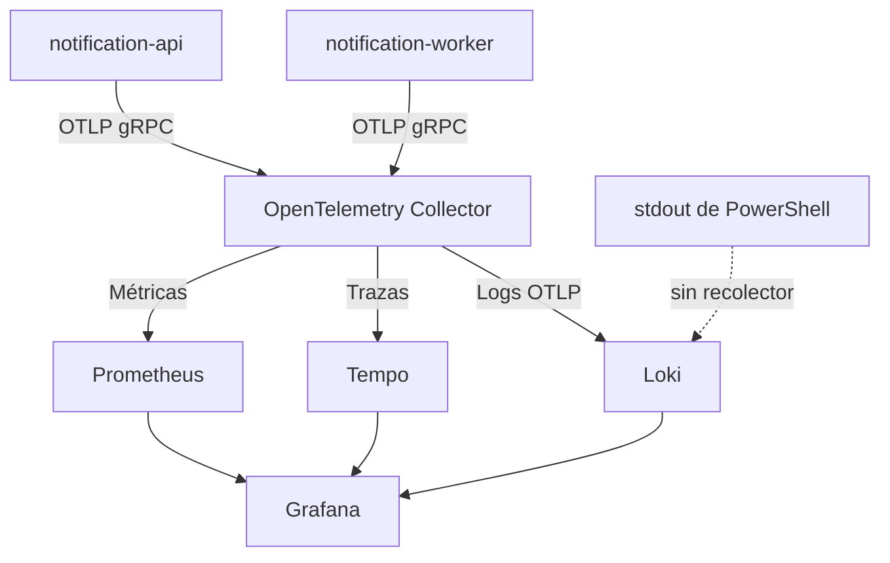
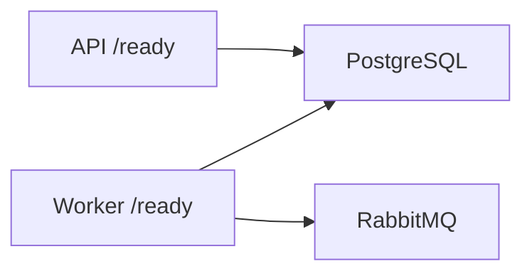
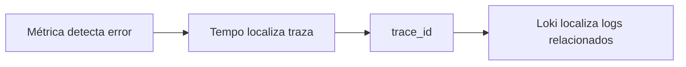

# Diagramas — HU-007

## Flujo de telemetría

```mermaid
flowchart TD
    A["notification-api"] -->|OTLP gRPC| C["OpenTelemetry Collector"]
    B["notification-worker"] -->|OTLP gRPC| C
    C -->|Métricas| D["Prometheus"]
    C -->|Trazas| E["Tempo"]
    C -->|Logs OTLP| F["Loki"]
    D --> G["Grafana"]
    E --> G
    F --> G
    H["stdout de PowerShell"] -. "sin recolector" .-> F
```

## Readiness

```mermaid
flowchart LR
    A["API /ready"] --> B["PostgreSQL"]
    C["Worker /ready"] --> D["RabbitMQ"]
    C --> B
```

## Correlación deseada

```mermaid
flowchart LR
    A["Métrica detecta error"] --> B["Tempo localiza traza"]
    B --> C["trace_id"]
    C --> D["Loki localiza logs relacionados"]
```

El último paso requiere que la aplicación o un agente envíe los logs a Loki.
