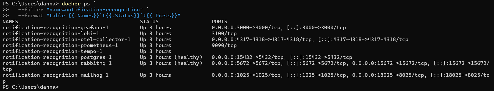
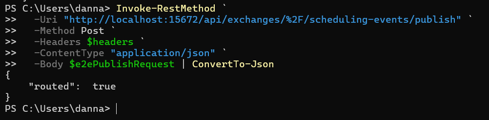
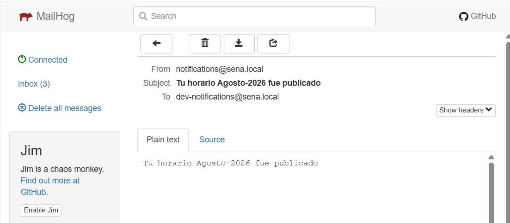
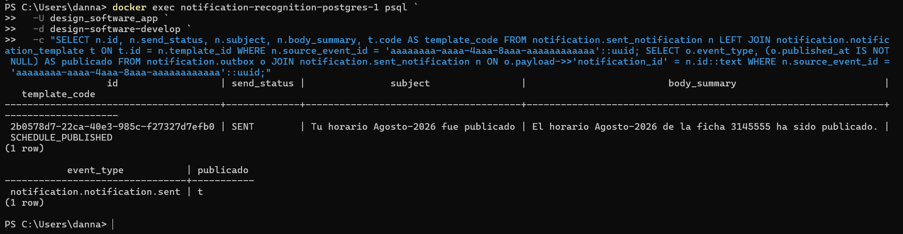
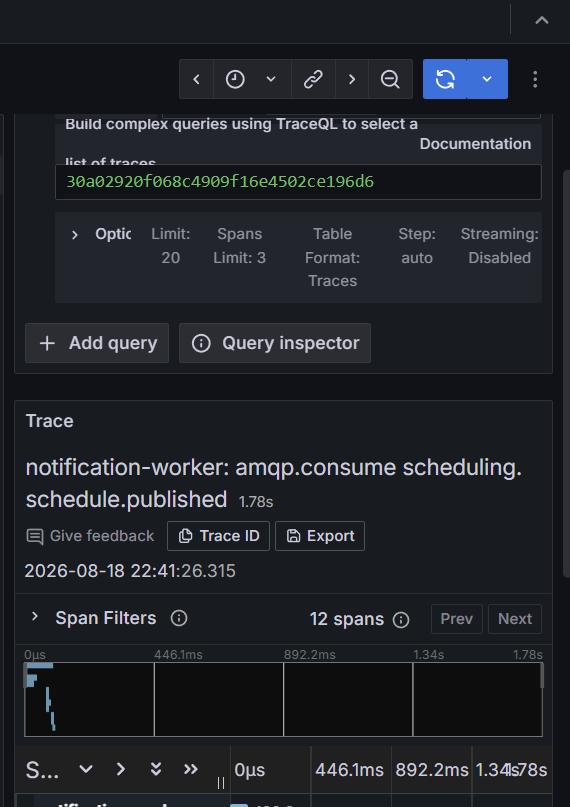

# HU-008 — Ejecución local end-to-end

## Objetivo

Demostrar el entorno local completo y seguir un evento desde RabbitMQ hasta su entrega, persistencia, Outbox y traza distribuida.

## Cómo entendí la HU

Esta HU integra los componentes estudiados por separado. Un evento externo debe ser enrutado, consumido, transformado mediante una plantilla, entregado por un canal, persistido y observado.

```text
RabbitMQ → worker → plantilla → SMTP/MailHog
                   └→ PostgreSQL + Outbox
                   └→ OpenTelemetry → Tempo
```

## Componentes del entorno

| Componente | Función | Acceso local |
|---|---|---|
| PostgreSQL | Notificaciones, plantillas y Outbox | `localhost:15432` |
| RabbitMQ | Exchanges, bindings y cola | `localhost:5672`, UI `15672` |
| MailHog | SMTP y bandeja de prueba | SMTP `1025`, UI `18025` |
| OTel Collector | Recepción de telemetría | `4317`, `4318` |
| Prometheus | Métricas | Interno |
| Tempo | Trazas | Interno |
| Loki | Logs | Interno |
| Grafana | Exploración LGTM | `localhost:3000` |
| API | Solicitudes HTTP | `localhost:8080` |
| Worker | Consumo AMQP y health | health `localhost:8081` |

Los ocho contenedores del proyecto `notification-recognition` estuvieron activos; PostgreSQL y RabbitMQ aparecieron además como `healthy`.

## Evento utilizado

```json
{
  "event_id": "aaaaaaaa-aaaa-4aaa-8aaa-aaaaaaaaaaaa",
  "event_type": "scheduling.schedule.published",
  "source_service": "scheduling-service",
  "payload": {
    "published_by": "bbbbbbbb-bbbb-4bbb-8bbb-bbbbbbbbbbbb",
    "schedule_name": "Agosto-2026",
    "ficha": "3145555"
  }
}
```

Se publicó en `scheduling-events` con routing key `scheduling.schedule.published`. RabbitMQ respondió `routed: true`.

## Resultado end-to-end

1. El binding encaminó el evento a `notification-service.events`.
2. `notification-worker` consumió el mensaje.
3. El caso de uso seleccionó `SCHEDULE_PUBLISHED`.
4. Renderizó asunto y cuerpo con `Agosto-2026` y `3145555`.
5. SMTP entregó el correo a MailHog, que aumentó a `Inbox (3)`.
6. PostgreSQL guardó la notificación con estado `SENT`.
7. Outbox registró `notification.notification.sent` y quedó publicado.
8. Tempo registró la traza `amqp.consume scheduling.schedule.published`, con `12 spans` y duración de `1.78 s`.

## Hallazgo de contenido SMTP

PostgreSQL conservó correctamente:

```text
El horario Agosto-2026 de la ficha 3145555 ha sido publicado.
```

Sin embargo, el cuerpo visible en MailHog repitió el asunto. La implementación de `SMTPNotifier` utiliza `n.Subject` tanto en el encabezado como en el cuerpo, en lugar de usar `n.BodySummary` para el contenido.

## Evidencias

- [Guía reproducible](comandos.md)
- [Diagrama end-to-end](diagramas/end-to-end-hu-008.md)
- Video: se integrará en el video general.

### Entorno



### Entrada AMQP



### Entrega



### Persistencia y salida



### Observabilidad



## Mejora propuesta

Corregir `SMTPNotifier` para utilizar `BodySummary` como cuerpo y `Subject` únicamente como asunto. Añadir una prueba de integración que compare la plantilla renderizada, la fila persistida y el mensaje SMTP capturado.

También conviene ofrecer un único comando o compose específico del microservicio que levante dependencias, aplique migraciones y ejecute API/worker con variables locales seguras, acompañado de un smoke test end-to-end automatizado.

## Guion para la sustentación

> En la HU-008 mostré los ocho contenedores del laboratorio y publiqué scheduling.schedule.published. RabbitMQ lo enrutó al worker; el caso de uso aplicó SCHEDULE_PUBLISHED; MailHog recibió el correo; PostgreSQL guardó estado SENT; Outbox publicó notification.notification.sent; y Tempo mostró una traza de 12 spans. Detecté que la base de datos conserva el cuerpo con la ficha, pero SMTP repite el asunto como cuerpo. Propongo usar BodySummary y cubrir el flujo con una prueba end-to-end automatizada.
