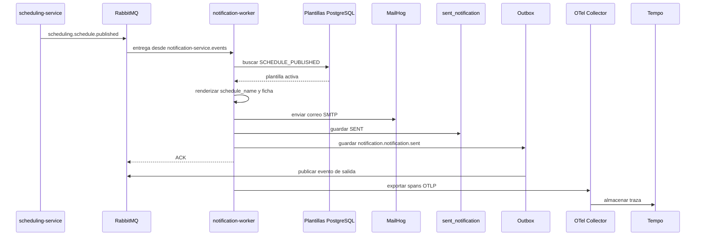
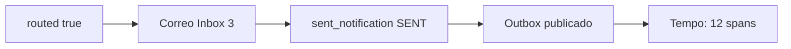

# Diagrama end-to-end — HU-008

```mermaid
sequenceDiagram
    participant S as scheduling-service
    participant R as RabbitMQ
    participant W as notification-worker
    participant T as Plantillas PostgreSQL
    participant M as MailHog
    participant DB as sent_notification
    participant O as Outbox
    participant C as OTel Collector
    participant TP as Tempo

    S->>R: scheduling.schedule.published
    R->>W: entrega desde notification-service.events
    W->>T: buscar SCHEDULE_PUBLISHED
    T-->>W: plantilla activa
    W->>W: renderizar schedule_name y ficha
    W->>M: enviar correo SMTP
    W->>DB: guardar SENT
    W->>O: guardar notification.notification.sent
    W-->>R: ACK
    O->>R: publicar evento de salida
    W->>C: exportar spans OTLP
    C->>TP: almacenar traza
```

## Resultado comprobado

```mermaid
flowchart LR
    A["routed true"] --> B["Correo Inbox 3"]
    B --> C["sent_notification SENT"]
    C --> D["Outbox publicado"]
    D --> E["Tempo: 12 spans"]
```
