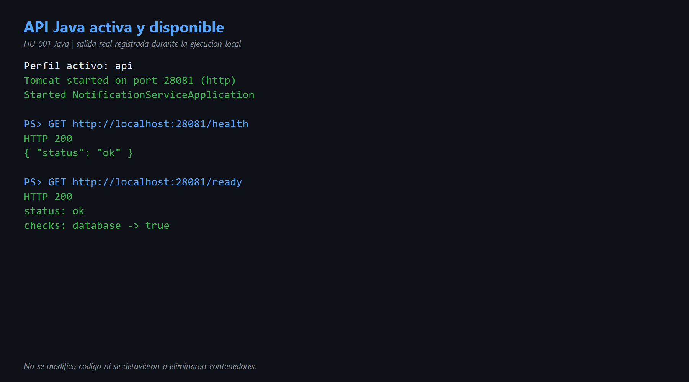
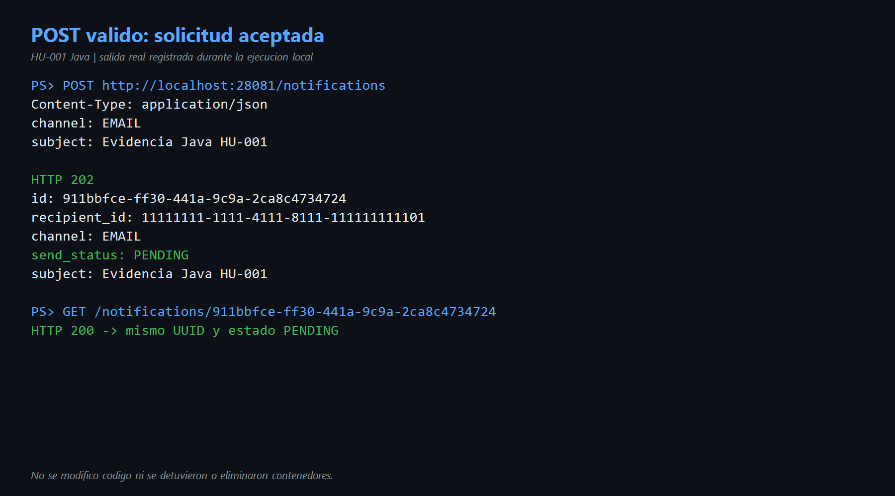
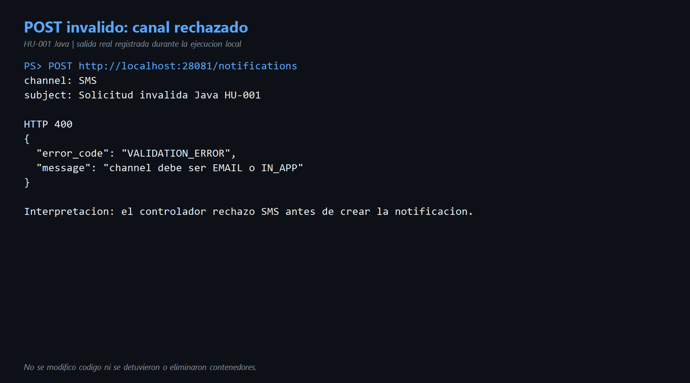
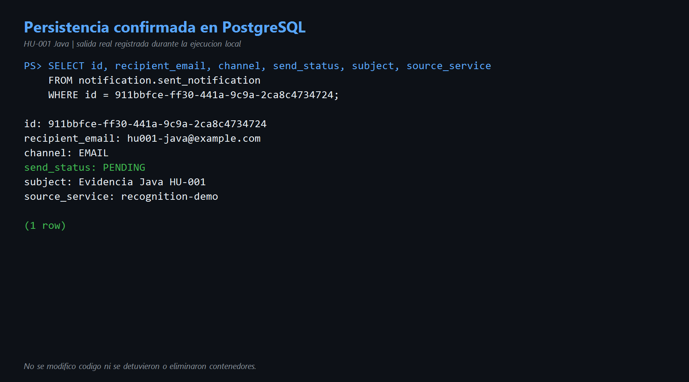

# HU-001 — Enviar notificación vía API (Java)

## Objetivo

Comprender y demostrar cómo la implementación Java recibe una solicitud mediante `POST /notifications`, valida sus datos, crea la notificación con estado inicial `PENDING` y la guarda en PostgreSQL.

## Cómo entendí la HU

El cliente envía un JSON con el destinatario, canal, asunto y servicio de origen. El controlador de Spring recibe la petición y comprueba los campos obligatorios. También convierte el texto del canal al enum `Channel`, que solo contiene `EMAIL` e `IN_APP`.

Si la solicitud es válida, el controlador construye un comando y llama al caso de uso. El caso de uso crea el objeto de dominio, le asigna el estado `PENDING` y delega la persistencia al repositorio JDBC. Finalmente, la API responde `202 Accepted` con el UUID creado.

`PENDING` no significa que el correo ya fue entregado. Significa que la solicitud fue aceptada y registrada. La entrega real corresponde al worker y se estudia en otras HU.

## Recorrido en el código Java

| Capa | Archivo y referencia | Responsabilidad |
|---|---|---|
| Entrada HTTP | [`NotificationController.java`](../codigo/notification-service/src/main/java/com/sena/notification_service/adapter/in/http/NotificationController.java) líneas 39-70 | Recibe el POST, valida, crea el comando y responde 202 o un error. |
| Contrato | [`SendNotificationRequest.java`](../codigo/notification-service/src/main/java/com/sena/notification_service/adapter/in/http/SendNotificationRequest.java) | Representa el JSON de entrada. |
| Dominio | [`Channel.java`](../codigo/notification-service/src/main/java/com/sena/notification_service/domain/model/Channel.java) | Define los canales permitidos: `EMAIL` e `IN_APP`. |
| Aplicación | [`SendNotificationService.java`](../codigo/notification-service/src/main/java/com/sena/notification_service/application/usecase/SendNotificationService.java) líneas 22-50 | Crea la notificación, asigna `PENDING` y llama al repositorio. |
| Puerto de salida | [`NotificationRepository.java`](../codigo/notification-service/src/main/java/com/sena/notification_service/port/out/NotificationRepository.java) | Evita que el caso de uso dependa directamente de JDBC. |
| Persistencia | [`JdbcNotificationRepository.java`](../codigo/notification-service/src/main/java/com/sena/notification_service/adapter/out/persistence/JdbcNotificationRepository.java) líneas 31-52 | Inserta la notificación en `notification.sent_notification`. |

El flujo observado es:

```text
Cliente → controlador HTTP → caso de uso → puerto de repositorio
        → adaptador JDBC → PostgreSQL → respuesta 202
```

Esta separación corresponde a arquitectura hexagonal: HTTP y JDBC son adaptadores; el caso de uso y el dominio contienen la lógica principal.

## Entorno verificado

- Java: JDK 24 disponible; el proyecto declara Java 21 como versión mínima.
- Spring Boot: 4.1.0.
- Perfil ejecutado: `api`.
- API Java de reconocimiento: `http://localhost:28081`.
- Se eligió `28081` para no interferir con la API Go que utiliza `8080`.
- PostgreSQL existente: puerto local `15432`.
- No se detuvo, eliminó ni recreó ningún contenedor.
- No se modificó el código fuente.

Comprobaciones de disponibilidad:

```text
GET /health → HTTP 200 → {"status":"ok"}
GET /ready  → HTTP 200 → database: true
```

## Demostración positiva

Solicitud utilizada:

```json
{
  "recipient_id": "11111111-1111-4111-8111-111111111101",
  "recipient_email": "hu001-java@example.com",
  "channel": "EMAIL",
  "subject": "Evidencia Java HU-001",
  "source_service": "recognition-demo"
}
```

Resultado real:

```text
HTTP 202
id: 911bbfce-ff30-441a-9c9a-2ca8c4734724
channel: EMAIL
send_status: PENDING
subject: Evidencia Java HU-001
```

Después se consultó `GET /notifications/911bbfce-ff30-441a-9c9a-2ca8c4734724`, que respondió `HTTP 200` con los mismos datos.

La verificación de solo lectura en PostgreSQL encontró exactamente una fila con el mismo UUID, correo ficticio, canal `EMAIL`, estado `PENDING` y `source_service` igual a `recognition-demo`.

## Demostración de validación

Se repitió la solicitud con `channel: "SMS"`. El resultado real fue:

```text
HTTP 400
```

```json
{
  "error_code": "VALIDATION_ERROR",
  "message": "channel debe ser EMAIL o IN_APP"
}
```

Esto demuestra que el controlador rechaza un canal que no forma parte del dominio antes de crear la notificación.

## Evidencias y reproducción

- Comandos ejecutados: [`comandos.md`](comandos.md).
- Diagrama del flujo: [`diagramas/flujo-hu-001.md`](diagramas/flujo-hu-001.md).
- Las imágenes siguientes son representaciones legibles de las salidas reales registradas durante esta ejecución local; cada una lo indica expresamente.
- Video: se integrará en la demostración general del microservicio Java.

### 1. API, health y readiness



### 2. Solicitud válida y consulta



### 3. Validación del canal



### 4. Persistencia



## Hallazgo técnico durante el reconocimiento

El `mvnw.cmd` suministrado no logró iniciar Maven en este equipo y mostró `Cannot start maven from wrapper`. Como la regla de la actividad prohíbe cambiar código, no se corrigió el wrapper. La aplicación sí se ejecutó correctamente con el JAR ya construido y todas las comprobaciones en vivo de esta HU pasaron.

## Mejora propuesta

Agregar el encabezado HTTP `Location: /notifications/{id}` a la respuesta `202 Accepted`. Así el cliente sabría de manera estándar dónde consultar el recurso creado.

Como mejora adicional de operación, convendría documentar en el README original el formato exacto de `NOTIFICATION_DB_DSN` y una alternativa validada para ejecutar Maven Wrapper en Windows.

## Conclusión para explicar en la exposición

> La HU-001 no envía todavía el mensaje. Su responsabilidad es aceptar una solicitud válida, convertirla en una notificación del dominio con estado PENDING y persistirla. En Java el controlador Spring funciona como adaptador de entrada, el caso de uso contiene la operación y el repositorio JDBC es el adaptador de salida. Lo demostré con un POST válido que respondió 202 y quedó guardado en PostgreSQL, y con un POST inválido usando SMS que fue rechazado con 400.
