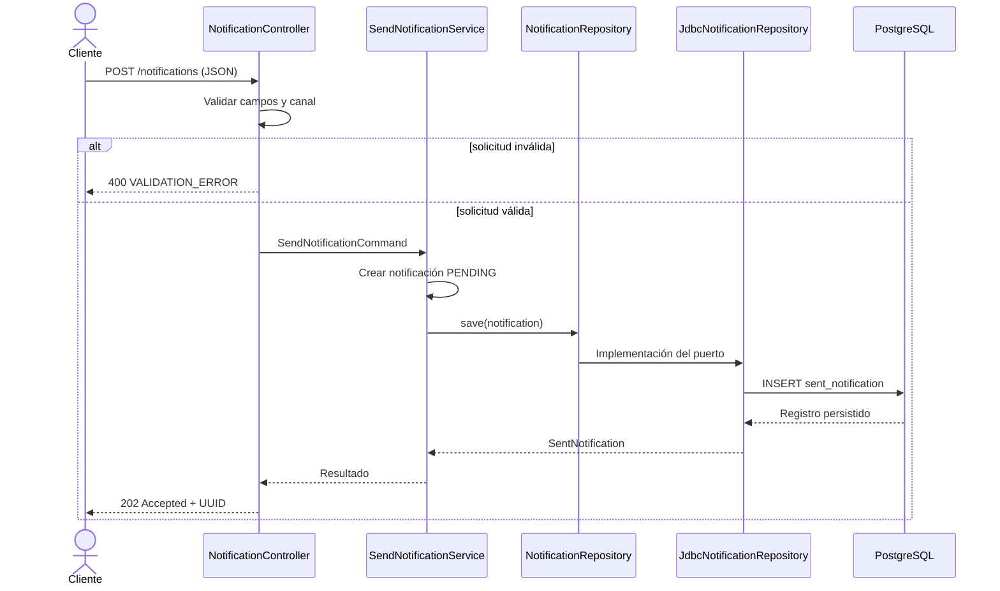

# Diagrama — HU-001 Java



## Lectura sencilla

1. El controlador recibe y valida el JSON.
2. Una solicitud inválida termina con `400` y no avanza al caso de uso.
3. Una solicitud válida se convierte en un comando.
4. El caso de uso crea la notificación con estado `PENDING`.
5. El repositorio JDBC la guarda en PostgreSQL.
6. La API devuelve `202` y el UUID para consultarla después.

## Patrón observado

```text
Adaptador de entrada        Núcleo de la aplicación       Adaptador de salida
Spring HTTP Controller  →   Caso de uso + dominio     →   JDBC + PostgreSQL
```

El caso de uso conoce el puerto `NotificationRepository`, pero no necesita conocer los detalles de PostgreSQL. Esa inversión de dependencias es una característica central de la arquitectura hexagonal.
