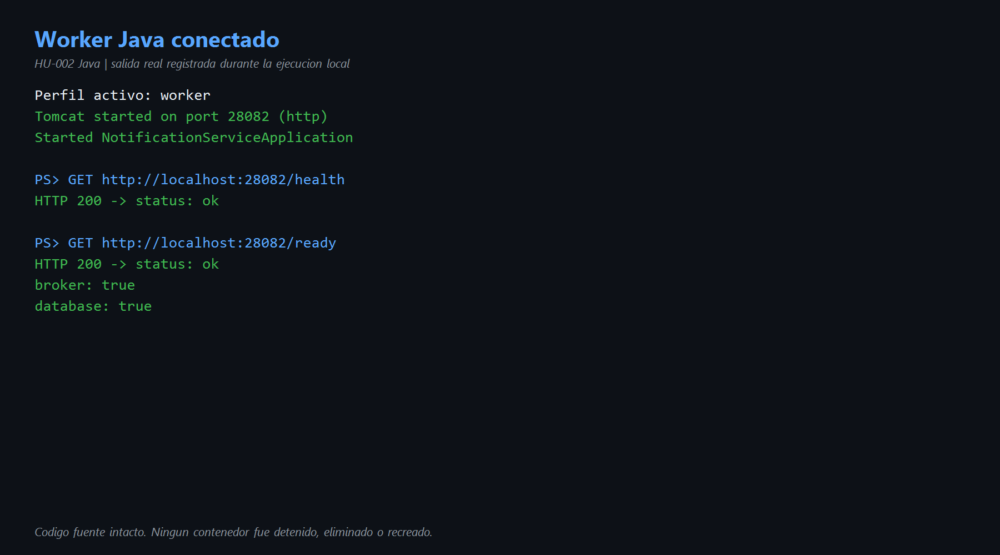
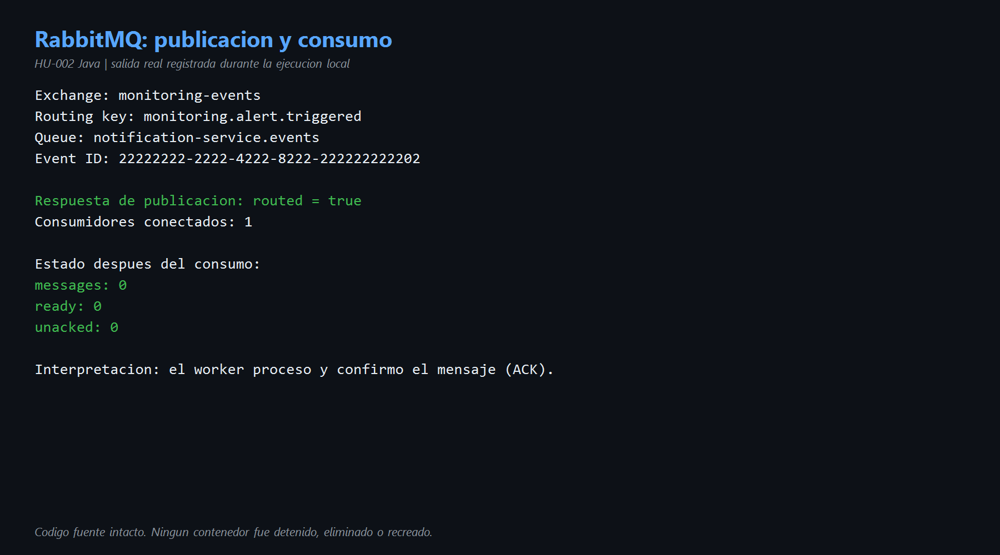
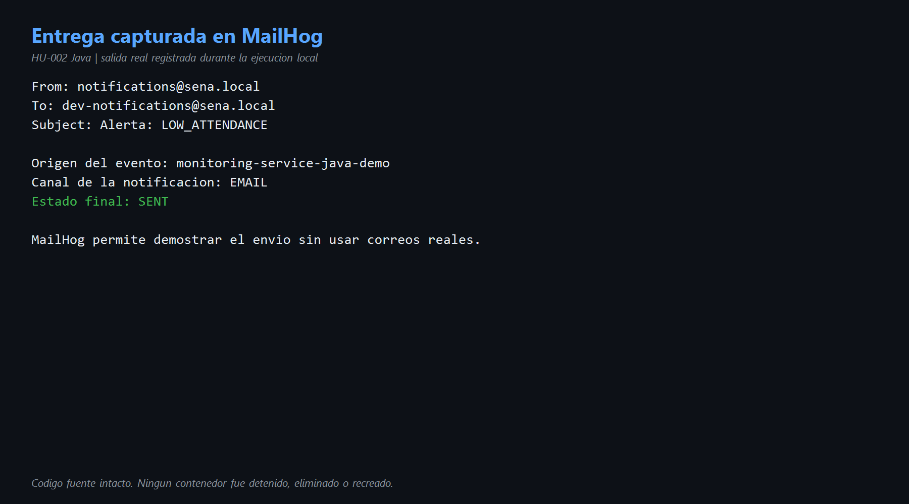
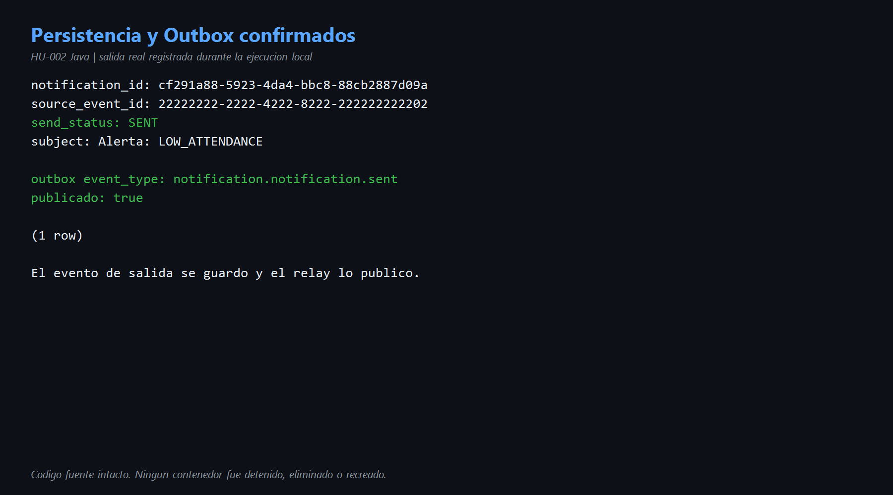

# HU-002 — Consumir eventos AMQP (Java)

## Objetivo

Demostrar que el worker Java escucha RabbitMQ, consume un evento de dominio soportado, confirma el mensaje, genera la notificación, la entrega mediante SMTP local, la persiste y crea su evento de salida en Outbox.

## Cómo entendí la HU

AMQP permite que otros microservicios publiquen eventos sin llamar directamente a la API de notificaciones. El exchange recibe el evento y usa la `routing key` para decidir a qué cola enviarlo. El worker permanece conectado a `notification-service.events` y procesa lo que llegue.

En esta prueba se publicó `monitoring.alert.triggered`. RabbitMQ lo encaminó, el consumidor Java validó el sobre, el caso de uso resolvió un destinatario ficticio, cargó la plantilla `ALERT_TRIGGERED`, envió el correo a MailHog y guardó el resultado `SENT`. También guardó `notification.notification.sent` en Outbox para su publicación confiable.

Que la cola termine en cero es correcto: el mensaje fue consumido y confirmado mediante ACK.

## Componentes y código reconocido

| Componente | Código Java | Responsabilidad |
|---|---|---|
| Topología | [`RabbitTopologyConfiguration.java`](../codigo/notification-service/src/main/java/com/sena/notification_service/config/RabbitTopologyConfiguration.java) líneas 15-28 | Declara exchanges, cola y bindings. |
| Consumidor | [`DomainEventConsumer.java`](../codigo/notification-service/src/main/java/com/sena/notification_service/adapter/in/amqp/DomainEventConsumer.java) líneas 44-65 | Lee, valida, procesa y hace ACK/NACK. |
| Caso de uso | [`ConsumeDomainEventService.java`](../codigo/notification-service/src/main/java/com/sena/notification_service/application/usecase/ConsumeDomainEventService.java) líneas 46-104 | Convierte el evento en notificación, entrega y persiste. |
| SMTP | [`SmtpNotifier.java`](../codigo/notification-service/src/main/java/com/sena/notification_service/adapter/out/notifier/SmtpNotifier.java) | Envía el correo al servidor SMTP local. |
| Persistencia | [`JdbcNotificationRepository.java`](../codigo/notification-service/src/main/java/com/sena/notification_service/adapter/out/persistence/JdbcNotificationRepository.java) líneas 58-105 | Guarda notificación y Outbox en una transacción. |

Topología observada:

```text
monitoring-events
  └─ routing key: monitoring.alert.triggered
       └─ notification-service.events
            └─ notification-worker Java
```

## Entorno verificado

- Worker Java: `http://localhost:28082`.
- `GET /health`: HTTP 200, `status: ok`.
- `GET /ready`: HTTP 200, `broker: true` y `database: true`.
- RabbitMQ: `localhost:5672`; interfaz local en `15672`.
- MailHog: SMTP `1025`; interfaz/API local en `18025`.
- PostgreSQL: puerto local `15432`.
- Un solo consumidor conectado durante la prueba: el worker Java.
- Código fuente intacto y contenedores existentes sin cambios.

## Evento ejecutado

```json
{
  "event_id": "22222222-2222-4222-8222-222222222202",
  "event_type": "monitoring.alert.triggered",
  "source_service": "monitoring-service-java-demo",
  "version": "1.0",
  "payload": {
    "affected_entity_type": "Learner",
    "affected_entity_id": "33333333-3333-4333-8333-333333333302",
    "alert_type_code": "LOW_ATTENDANCE"
  }
}
```

Resultado de publicación:

```json
{"routed": true}
```

## Resultado de extremo a extremo

- RabbitMQ tuvo `1` consumidor.
- Después del procesamiento: `messages: 0`, `ready: 0`, `unacked: 0`.
- MailHog recibió el asunto `Alerta: LOW_ATTENDANCE` para `dev-notifications@sena.local`.
- PostgreSQL creó la notificación `cf291a88-5923-4da4-bbc8-88cb2887d09a`.
- Estado persistido: `SENT`.
- Servicio de origen: `monitoring-service-java-demo`.
- Se creó el evento Outbox `notification.notification.sent`.
- `published_at` quedó informado, por lo que el relay ya lo publicó.

## ACK y NACK en palabras sencillas

- `ACK`: el worker informa a RabbitMQ que terminó con el mensaje. RabbitMQ puede retirarlo de la cola.
- `NACK`: el worker rechaza un sobre inválido. En este proyecto se usa `requeue=false`, por lo que no vuelve a la misma cola.
- Si el sobre es válido pero ocurre un error de negocio, el código registra el error y hace ACK para mantener la semántica de la implementación Go original.

## Evidencias

- [Comandos reproducibles](comandos.md)
- [Diagrama del flujo](diagramas/flujo-hu-002.md)
- Video: se integrará en la demostración general de Java.

### Worker disponible



### RabbitMQ



### MailHog



### PostgreSQL y Outbox



## Mejora propuesta

Agregar una cola de mensajes muertos o DLQ para conservar sobres inválidos. Actualmente el consumidor hace NACK con `requeue=false`; el mensaje desaparece de la cola principal y solo queda el log. Una DLQ permitiría investigarlo y reprocesarlo de forma controlada.

También conviene registrar explícitamente un log de éxito con `event_id`, `notification_id` y duración. Facilitaría la demostración y el diagnóstico sin consultar directamente la base de datos.

## Conclusión para la exposición

> La HU-002 demuestra comunicación asíncrona. El productor no llama directamente al worker: publica un evento en un exchange de RabbitMQ. La routing key lo lleva a notification-service.events y el worker Java lo consume. En la prueba hubo un único consumidor, el evento fue enrutado, la cola volvió a cero, MailHog recibió el correo, PostgreSQL guardó SENT y Outbox publicó notification.notification.sent. El ACK confirma que RabbitMQ puede retirar el mensaje procesado.
