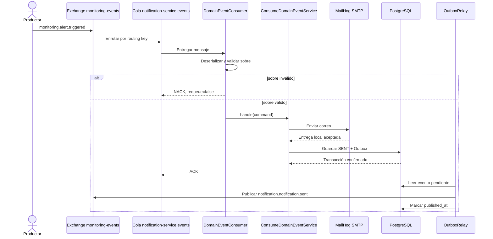

# Diagrama — HU-002 Java

## Ideas clave

- El exchange enruta; no almacena el mensaje como una cola.
- La cola desacopla al productor del worker.
- El ACK se realiza después de ejecutar el caso de uso.
- Notificación y Outbox se guardan juntas para evitar perder el evento de salida.
- MailHog reemplaza un servidor de correo real durante la demostración local.
