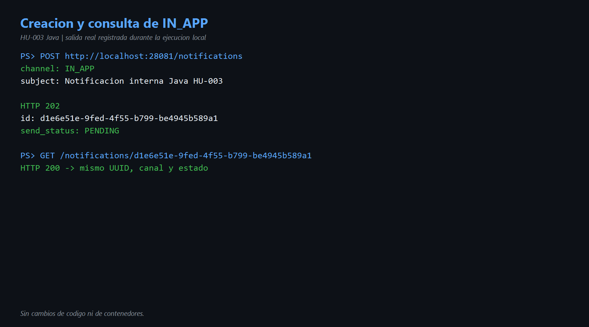
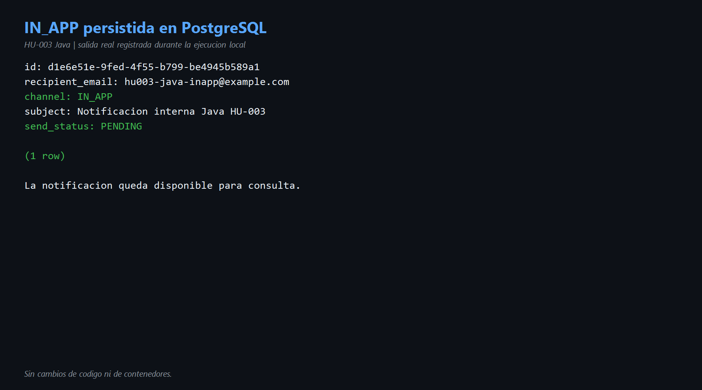
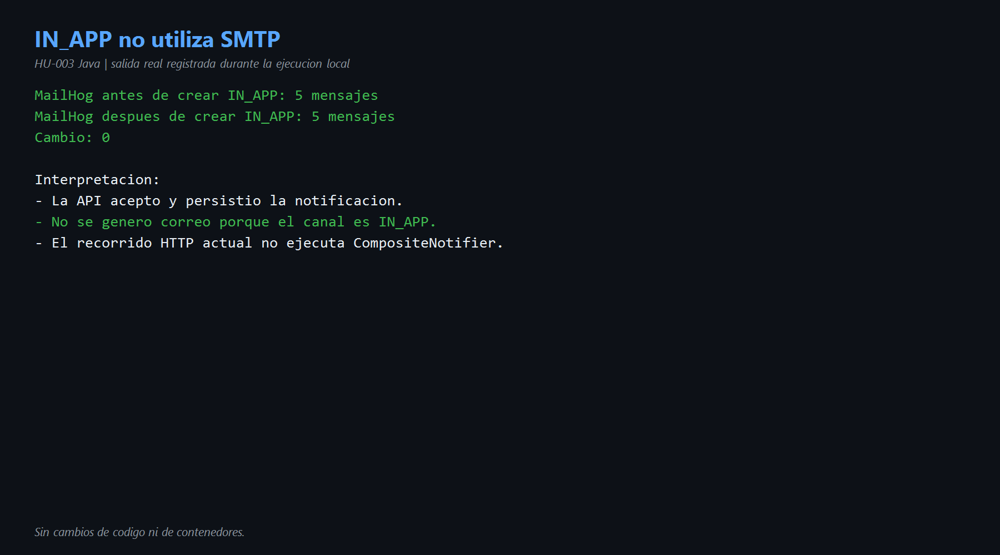

# HU-003 — Entrega por canales EMAIL e IN_APP (Java)

## Objetivo

Comprender cómo Java selecciona el adaptador de entrega según el canal y demostrar el comportamiento observable de `EMAIL` e `IN_APP`.

## Cómo entendí la HU

`CompositeNotifier` aplica una estrategia sencilla: si el canal es `EMAIL`, delega en `SmtpNotifier`; si es `IN_APP`, delega en `InAppNotifier`.

```text
CompositeNotifier
├── EMAIL  → SmtpNotifier → servidor SMTP → MailHog
└── IN_APP → InAppNotifier → sin efecto externo en esta versión
```

El adaptador `InAppNotifier` está vacío intencionalmente para conservar el mismo comportamiento de Go. La notificación interna se representa por el registro persistido y consultable, no por un correo.

## Código reconocido

| Archivo | Responsabilidad |
|---|---|
| [`CompositeNotifier.java`](../codigo/notification-service/src/main/java/com/sena/notification_service/adapter/out/notifier/CompositeNotifier.java) | Selecciona el adaptador según `Channel`. |
| [`SmtpNotifier.java`](../codigo/notification-service/src/main/java/com/sena/notification_service/adapter/out/notifier/SmtpNotifier.java) | Construye y envía el correo. |
| [`InAppNotifier.java`](../codigo/notification-service/src/main/java/com/sena/notification_service/adapter/out/notifier/InAppNotifier.java) | Adaptador sin efecto externo en la versión actual. |
| [`Channel.java`](../codigo/notification-service/src/main/java/com/sena/notification_service/domain/model/Channel.java) | Limita el dominio a `EMAIL` e `IN_APP`. |
| [`NotificationController.java`](../codigo/notification-service/src/main/java/com/sena/notification_service/adapter/in/http/NotificationController.java) | Acepta ambos canales mediante la API. |

## Demostración de EMAIL

La [HU-002](../hu-002/README.md) comprobó el camino EMAIL: el evento AMQP produjo el asunto `Alerta: LOW_ATTENDANCE`, MailHog lo recibió y PostgreSQL guardó `SENT`.

## Demostración de IN_APP

Se ejecutó:

```json
{
  "recipient_id": "44444444-4444-4444-8444-444444444403",
  "recipient_email": "hu003-java-inapp@example.com",
  "channel": "IN_APP",
  "subject": "Notificacion interna Java HU-003",
  "source_service": "recognition-demo-java"
}
```

Resultado:

```text
POST /notifications → HTTP 202
id: d1e6e51e-9fed-4f55-b799-be4945b589a1
channel: IN_APP
send_status: PENDING

GET /notifications/{id} → HTTP 200
```

PostgreSQL confirmó la misma fila. MailHog tenía 5 mensajes antes y 5 después: cambio `0`.

## Hallazgo importante

La API HTTP persiste `EMAIL` o `IN_APP`, pero no llama a `CompositeNotifier`; por eso las solicitudes creadas por POST quedan `PENDING`. El worker sí llama al notifier, pero `ConsumeDomainEventService` fija actualmente el canal `EMAIL`.

Por lo tanto, los dos adaptadores existen, pero el recorrido disponible no lleva una notificación `IN_APP` hasta `SENT`. Se documenta como comportamiento original; no se cambió el código.

## Evidencias

- [Comandos reproducibles](comandos.md)
- [Diagrama de canales](diagramas/canales-hu-003.md)
- Video: se integrará en la demostración general de Java.







## Mejora propuesta

Unificar la entrega mediante un flujo asíncrono: la API registraría la intención y el worker procesaría tanto `EMAIL` como `IN_APP`. El canal debería provenir de una regla o preferencia del destinatario, no estar fijado siempre en `EMAIL` para eventos.

Cuando una notificación `IN_APP` quede disponible para consulta, el flujo debería actualizarla a `SENT` y registrar su fecha de disponibilidad.

## Conclusión para la exposición

> CompositeNotifier representa el patrón Strategy: decide entre SMTP e IN_APP sin que el caso de uso conozca sus detalles. EMAIL sí tiene un efecto externo y se observa en MailHog. IN_APP no envía correo; en la prueba quedó persistida y consultable, mientras MailHog no cambió. También encontré que el POST no ejecuta la entrega y el worker fija EMAIL, por eso el recorrido IN_APP permanece PENDING.
