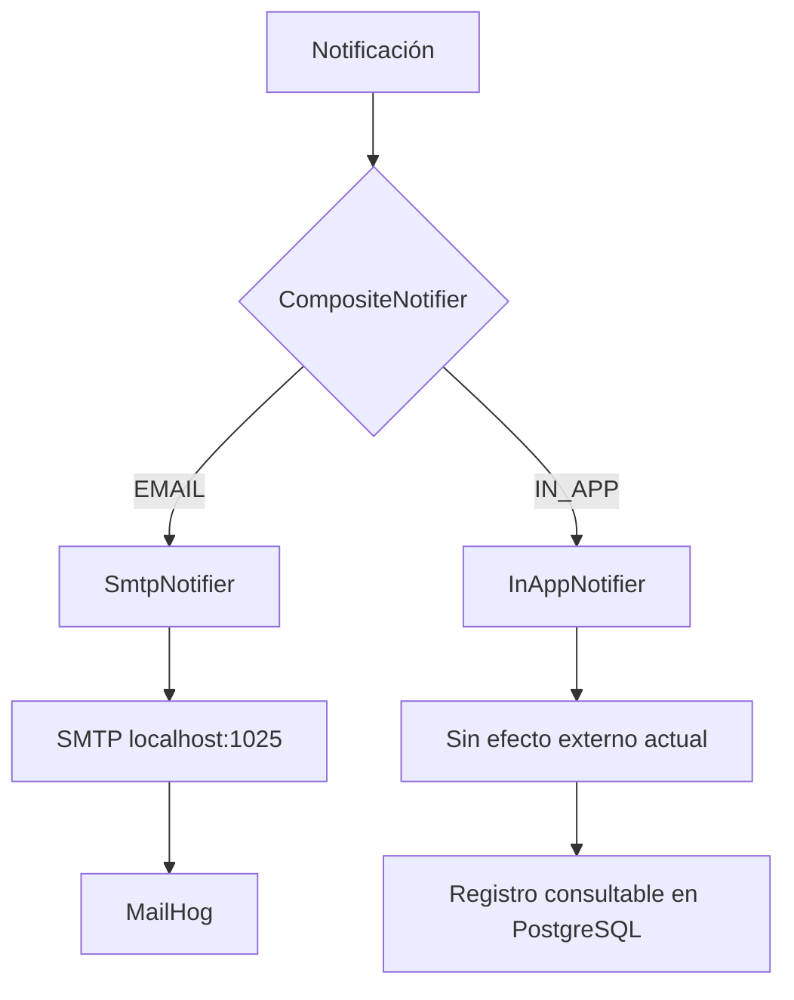

# Diagrama — selección de canales en Java



## Diferencia entre creación y entrega

```text
POST /notifications
    └─ valida y persiste PENDING
       └─ no llama a CompositeNotifier

Evento AMQP
    └─ worker llama a CompositeNotifier
       └─ actualmente crea siempre canal EMAIL
```

Los adaptadores soportan ambos canales, pero el flujo completo `IN_APP → SENT` todavía no está conectado en la implementación original.
