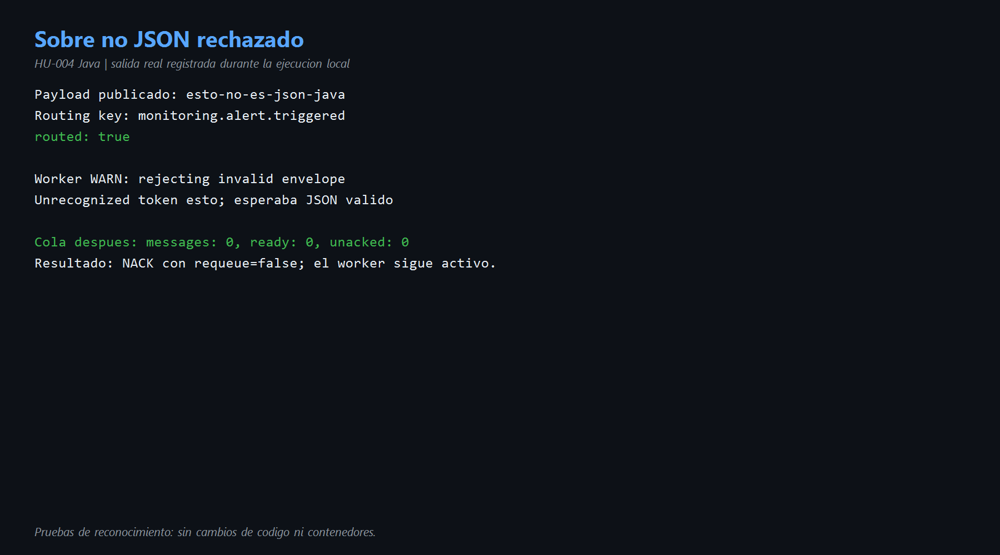
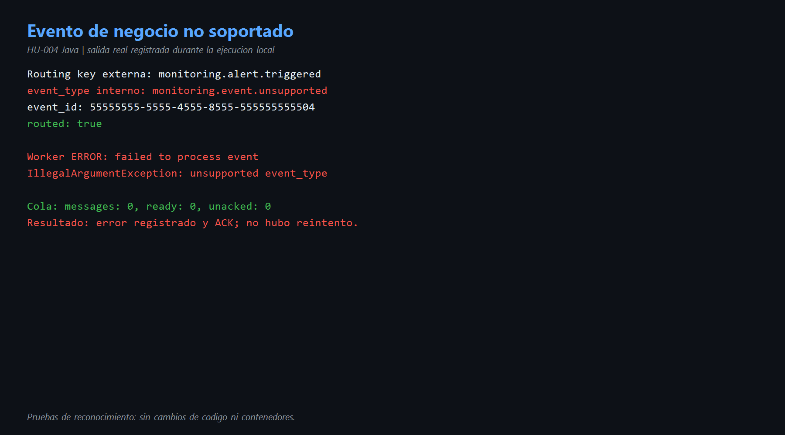
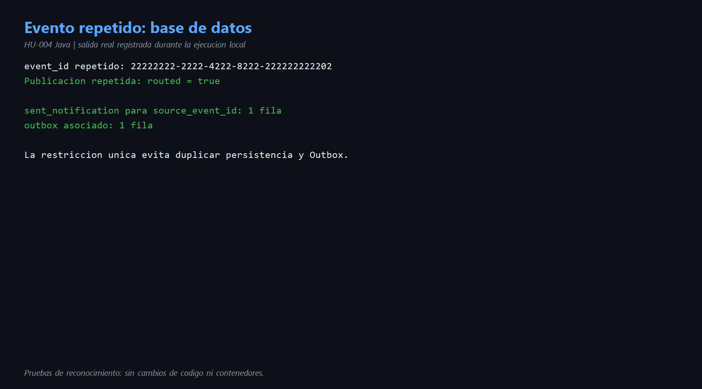
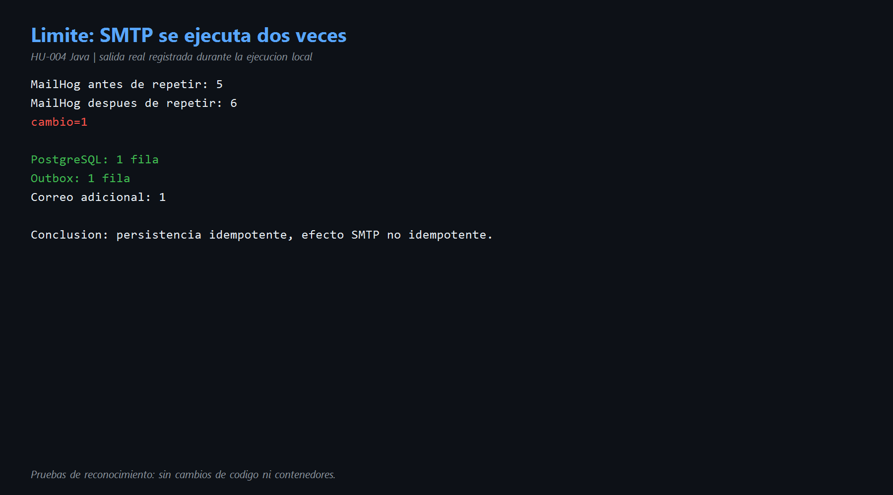

# HU-004 — Resiliencia e idempotencia (Java)

## Objetivo

Evaluar qué hace el worker Java con mensajes inválidos, eventos no soportados y entregas duplicadas, identificando tanto sus protecciones como sus límites.

## Conceptos

- **Resiliencia:** capacidad de continuar funcionando después de un fallo.
- **Reintento:** volver a procesar un error que podría ser temporal.
- **Backoff:** esperar cada vez más entre reintentos.
- **DLQ:** cola separada donde se conservan los mensajes que no pudieron procesarse.
- **Idempotencia:** repetir una operación produce un solo resultado lógico.

## Comportamiento encontrado

| Situación | Acción Java | Consecuencia |
|---|---|---|
| Cuerpo no JSON | `basicNack(..., requeue=false)` | Se rechaza y no vuelve a la cola. |
| Sobre válido con error de negocio | Se registra el error y luego se hace ACK | No hay reintento. |
| `source_event_id` repetido | `ON CONFLICT ... DO NOTHING` | No duplica notificación ni Outbox. |
| Correo de evento repetido | SMTP ocurre antes de persistir | El correo sí puede duplicarse. |

Código principal:

- [`DomainEventConsumer.java`](../codigo/notification-service/src/main/java/com/sena/notification_service/adapter/in/amqp/DomainEventConsumer.java) líneas 45-65.
- [`ConsumeDomainEventService.java`](../codigo/notification-service/src/main/java/com/sena/notification_service/application/usecase/ConsumeDomainEventService.java) líneas 77-104.
- [`JdbcNotificationRepository.java`](../codigo/notification-service/src/main/java/com/sena/notification_service/adapter/out/persistence/JdbcNotificationRepository.java) líneas 58-105.

## Prueba 1 — cuerpo no JSON

Se publicó `esto-no-es-json-java` usando la routing key soportada. RabbitMQ respondió `routed: true` y el worker registró:

```text
rejecting invalid envelope: Unrecognized token 'esto'
```

La cola quedó en cero y el worker continuó disponible. No se observó una DLQ, por lo que el mensaje rechazado no quedó conservado para análisis.

## Prueba 2 — tipo de evento no soportado

Primero se comprobó que una routing key inexistente produce `routed:false`. Después se hizo la prueba correcta: se usó la routing key soportada `monitoring.alert.triggered`, pero dentro del JSON se envió:

```text
event_id: 55555555-5555-4555-8555-555555555504
event_type: monitoring.event.unsupported
```

RabbitMQ respondió `routed:true`; el caso de uso recibió el mensaje y registró:

```text
failed to process event ...
unsupported event_type: monitoring.event.unsupported
```

Luego la cola quedó en cero. El consumidor confirmó el mensaje y no lo reintentó.

## Prueba 3 — idempotencia

Se volvió a publicar el `event_id` utilizado en HU-002:

```text
22222222-2222-4222-8222-222222222202
```

Resultado:

- `sent_notification`: 1 fila.
- Outbox asociado: 1 fila.
- MailHog: pasó de 5 a 6 mensajes.
- Cambio SMTP: `+1` correo.

Esto demuestra que la persistencia es idempotente, pero la entrega SMTP no lo es. El caso de uso llama a `notifier.send()` antes de que el repositorio detecte el conflicto por `source_event_id`.

## Aspectos positivos

- El worker no se cayó durante ninguna prueba.
- Usa confirmación manual de RabbitMQ.
- La base de datos impide duplicar la notificación por evento.
- Notificación y Outbox se guardan en una transacción.
- Los fallos quedan en logs con traza de error.

## Evidencias

- [Comandos reproducibles](comandos.md)
- [Diagrama del comportamiento y mejora](diagramas/resiliencia-hu-004.md)









## Mejora propuesta

Configurar reintentos limitados con backoff para fallos transitorios y una DLQ para conservar mensajes agotados o inválidos. La DLQ debería guardar motivo, número de intentos y datos de correlación.

Para idempotencia de extremo a extremo, el sistema debe reservar o comprobar `source_event_id` antes de llamar al proveedor SMTP, o persistir primero una tarea de entrega con clave única.

## Conclusión para la exposición

> El worker es resiliente porque no se cae ante JSON inválido ni eventos no soportados. Sin embargo, actualmente ambos mensajes salen de la cola sin reintento ni DLQ. La base de datos sí es idempotente por source_event_id, pero SMTP no: al repetir el evento quedó una fila y un Outbox, aunque apareció otro correo. La mejora prioritaria es combinar reintentos, DLQ y una reserva idempotente anterior al efecto externo.
