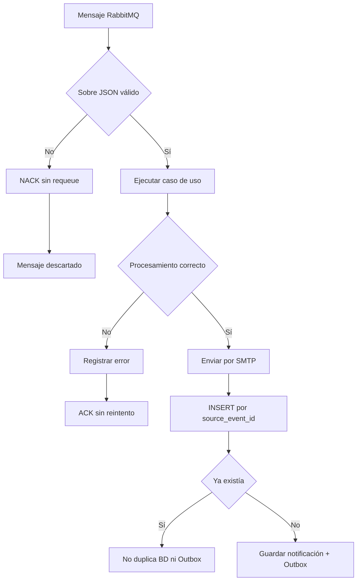
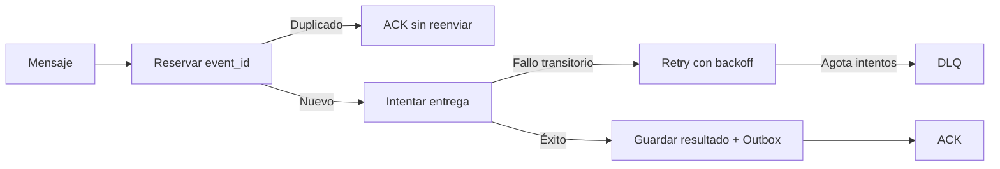

# Diagrama — resiliencia e idempotencia Java



## Límite actual

```text
Evento repetido
   ├─ SMTP ocurre primero       → correo duplicado
   └─ restricción única después → una sola fila
```

## Flujo recomendado


