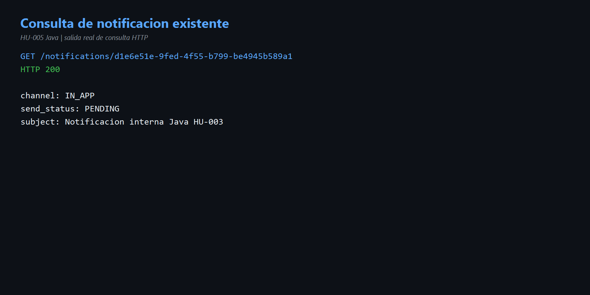
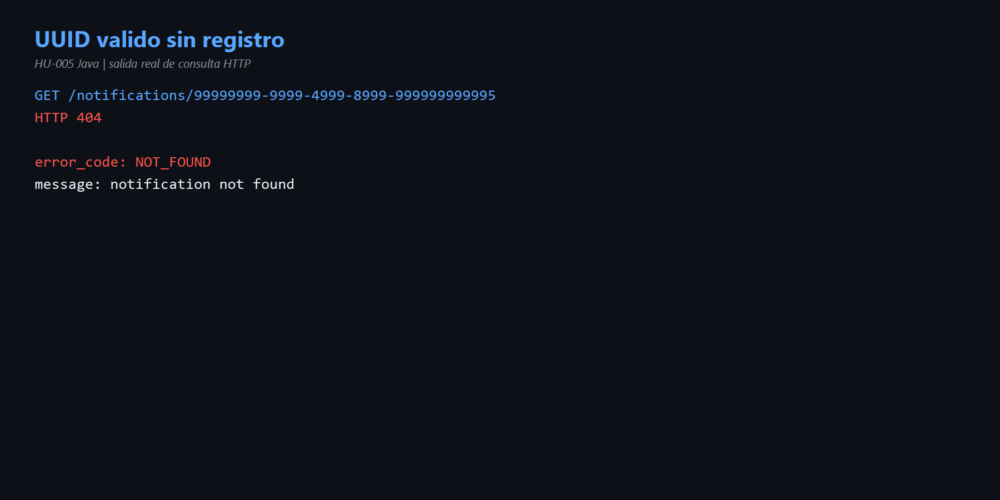
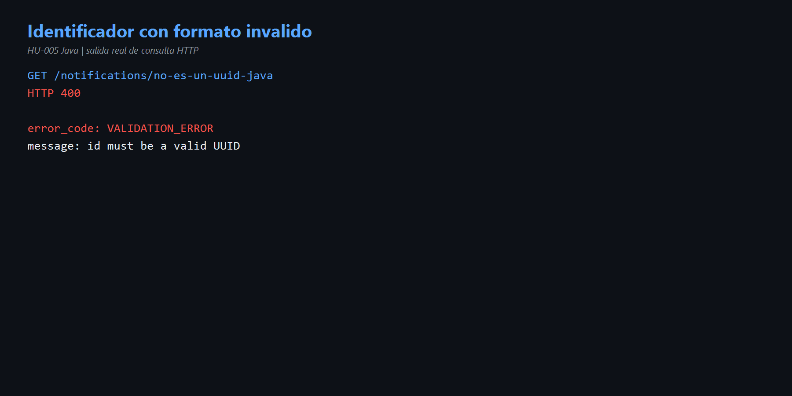

# HU-005 — Consultar una notificación (Java)

## Objetivo

Demostrar `GET /notifications/{id}` y distinguir una consulta exitosa, un recurso inexistente y un identificador mal formado.

## Cómo entendí la HU

El controlador recibe `id` como texto. Primero intenta convertirlo a UUID. Si el formato es incorrecto responde `400`; si el formato es válido consulta el repositorio; si no existe responde `404`; si existe devuelve `200` con su resumen.

```text
GET /notifications/{id}
  ├─ formato inválido         → 400 VALIDATION_ERROR
  ├─ UUID válido sin registro → 404 NOT_FOUND
  └─ registro encontrado      → 200 + notificación
```

## Código reconocido

- [`NotificationController.java`](../codigo/notification-service/src/main/java/com/sena/notification_service/adapter/in/http/NotificationController.java) líneas 74-95: valida el UUID y construye las respuestas.
- [`GetNotificationService.java`](../codigo/notification-service/src/main/java/com/sena/notification_service/application/usecase/GetNotificationService.java): caso de uso de consulta.
- [`JdbcNotificationRepository.java`](../codigo/notification-service/src/main/java/com/sena/notification_service/adapter/out/persistence/JdbcNotificationRepository.java) líneas 108-128: ejecuta el SELECT.

## Resultados reales

| Caso | Resultado |
|---|---|
| UUID existente `d1e6e51e-9fed-4f55-b799-be4945b589a1` | HTTP 200, canal `IN_APP`, estado `PENDING`. |
| UUID válido inexistente `99999999-9999-4999-8999-999999999995` | HTTP 404, `NOT_FOUND`. |
| `no-es-un-uuid-java` | HTTP 400, `VALIDATION_ERROR`. |

La consulta no cambia el estado ni vuelve a enviar la notificación; es una operación de lectura.

## Evidencias

- [Comandos reproducibles](comandos.md)
- [Diagrama de decisiones](diagramas/consulta-hu-005.md)







## Mejora propuesta

Incluir `created_at`, `sent_at` y `failure_reason` en la respuesta de consulta. Esos campos existen en persistencia y ayudarían a saber cuándo se creó, cuándo se entregó o por qué falló.

## Conclusión para la exposición

> HU-005 permite consultar una notificación por UUID. La API diferencia correctamente tres situaciones: 200 cuando existe, 404 cuando el UUID es válido pero no tiene registro y 400 cuando ni siquiera tiene formato UUID. Esto evita confundir un error de entrada con la ausencia real del recurso.
