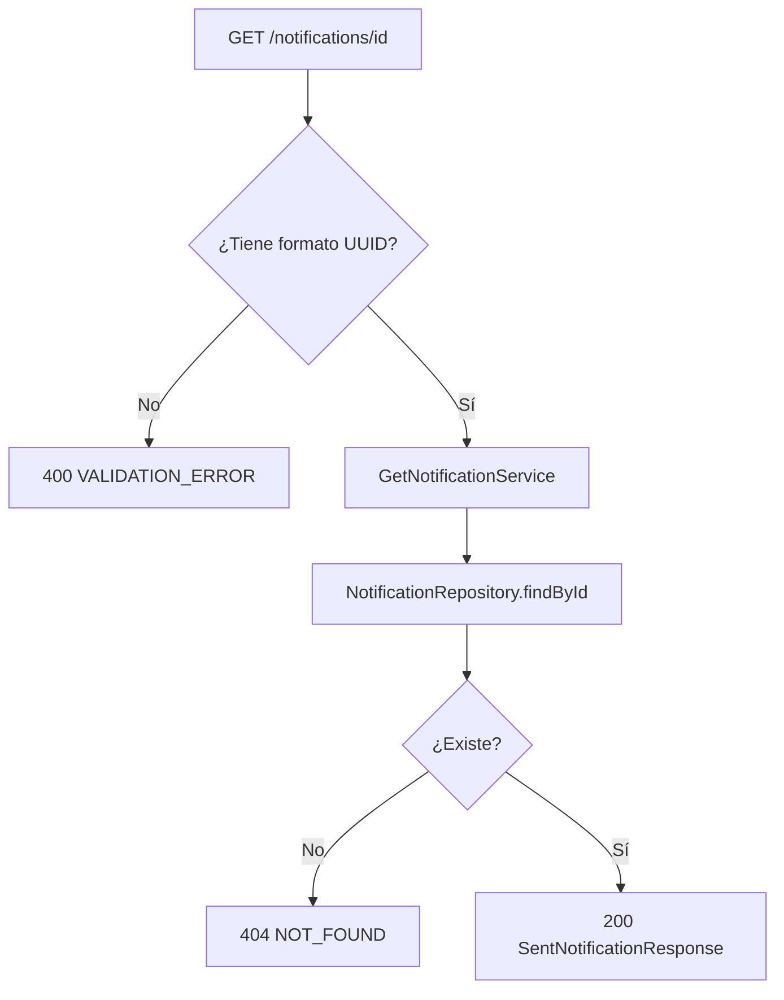

# Diagrama — HU-005 Java

```mermaid
flowchart TD
    A[GET /notifications/id] --> B{¿Tiene formato UUID?}
    B -->|No| C[400 VALIDATION_ERROR]
    B -->|Sí| D[GetNotificationService]
    D --> E[NotificationRepository.findById]
    E --> F{¿Existe?}
    F -->|No| G[404 NOT_FOUND]
    F -->|Sí| H[200 SentNotificationResponse]
```

La validación ocurre antes del SELECT y la consulta no modifica la fila.
