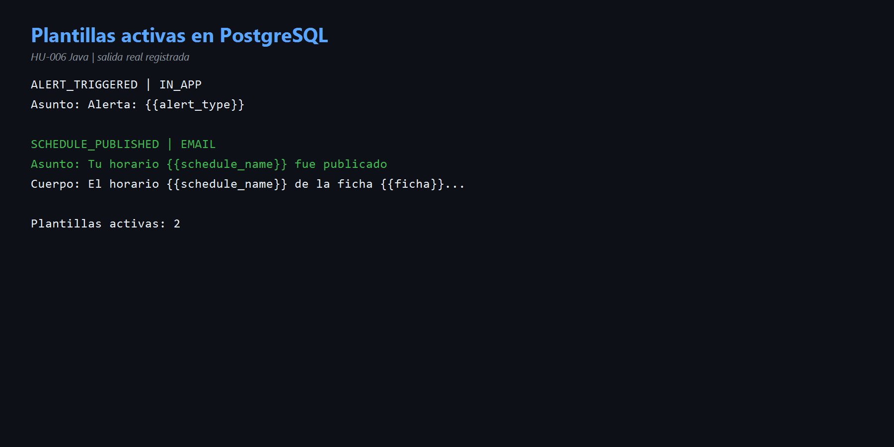
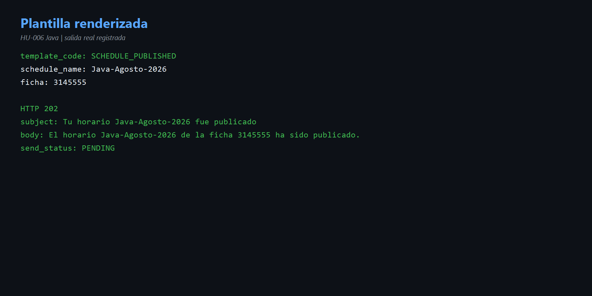
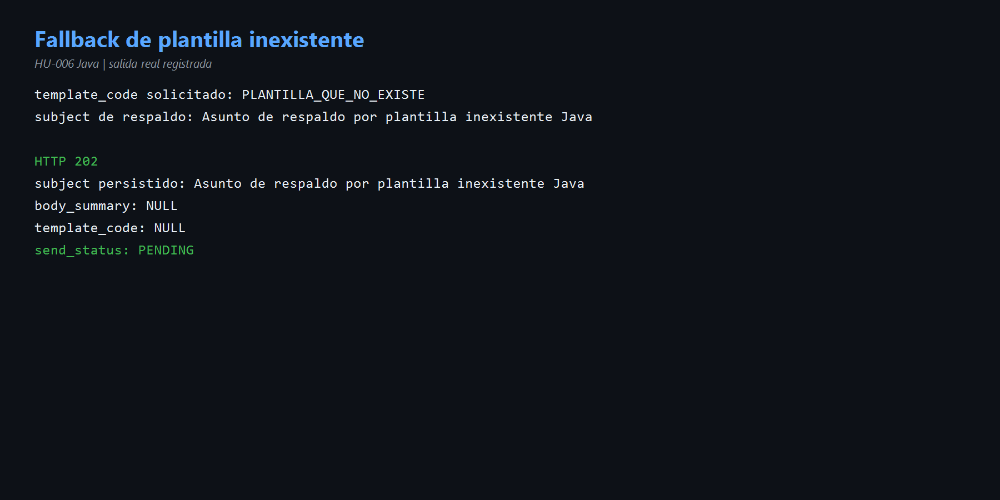

# HU-006 — Plantillas de notificación (Java)

## Objetivo

Demostrar cómo el microservicio carga una plantilla, sustituye variables y conserva un asunto de respaldo cuando la plantilla no existe.

## Cómo entendí la HU

Las plantillas separan el contenido del código. PostgreSQL guarda un código, canal, asunto, cuerpo y estado activo. La solicitud entrega `template_code` y `template_vars`; el caso de uso consulta la plantilla y `TemplateRenderer` reemplaza expresiones como `{{schedule_name}}`.

```text
template_code + variables
      ↓
buscar plantilla activa
      ↓
renderizar asunto y cuerpo
      ↓
persistir resultado
```

## Código reconocido

- [`SendNotificationService.java`](../codigo/notification-service/src/main/java/com/sena/notification_service/application/usecase/SendNotificationService.java) líneas 37-48: busca y aplica la plantilla.
- [`TemplateRenderer.java`](../codigo/notification-service/src/main/java/com/sena/notification_service/domain/service/TemplateRenderer.java): sustituye placeholders.
- [`JdbcTemplateRepository.java`](../codigo/notification-service/src/main/java/com/sena/notification_service/adapter/out/persistence/JdbcTemplateRepository.java): consulta por código.

## Plantillas encontradas

| Código | Canal | Asunto |
|---|---|---|
| `ALERT_TRIGGERED` | IN_APP | `Alerta: {{alert_type}}` |
| `SCHEDULE_PUBLISHED` | EMAIL | `Tu horario {{schedule_name}} fue publicado` |

Ambas estaban activas.

## Prueba con plantilla existente

Se envió `SCHEDULE_PUBLISHED` con:

```json
{
  "schedule_name": "Java-Agosto-2026",
  "ficha": "3145555"
}
```

Resultado real:

```text
HTTP 202
subject: Tu horario Java-Agosto-2026 fue publicado
body: El horario Java-Agosto-2026 de la ficha 3145555 ha sido publicado.
template_code persistido: SCHEDULE_PUBLISHED
```

El asunto de respaldo enviado originalmente fue reemplazado por la plantilla.

## Prueba de fallback

Con `PLANTILLA_QUE_NO_EXISTE`, la API respondió `202` y conservó:

```text
subject: Asunto de respaldo por plantilla inexistente Java
body_summary: NULL
template_code: NULL
```

El fallback evita que la solicitud falle cuando la plantilla no está disponible. Sin embargo, el `catch` actual ignora cualquier error de consulta, por lo que un problema real de base de datos también podría quedar oculto.

## Evidencias

- [Comandos reproducibles](comandos.md)
- [Diagrama](diagramas/plantillas-hu-006.md)







## Mejora propuesta

Diferenciar “plantilla no encontrada” de “fallo al consultar PostgreSQL”. El primer caso puede usar fallback; el segundo debe registrarse y generar métrica o error controlado. También conviene validar variables obligatorias para no dejar placeholders sin sustituir.

## Conclusión para la exposición

> HU-006 demuestra contenido dinámico sin modificar código. El cliente indica un código y variables; Java busca la plantilla activa y reemplaza los placeholders. Con SCHEDULE_PUBLISHED obtuvo el asunto y cuerpo completos. Cuando la plantilla no existió, conservó el asunto de respaldo. Es tolerante, aunque recomiendo no ocultar errores reales de infraestructura.
