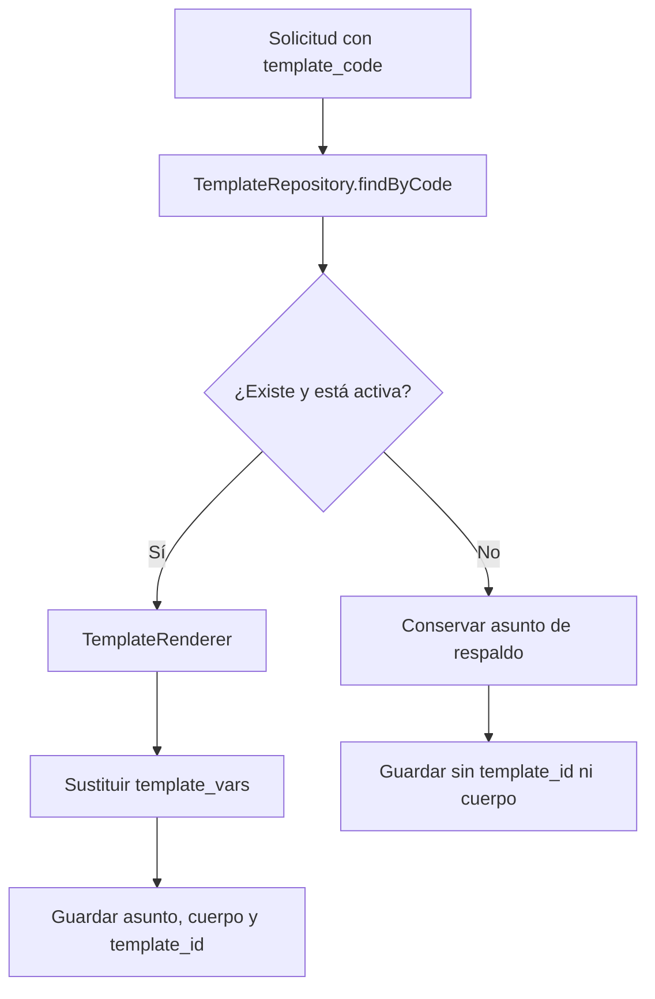

# Diagrama — HU-006 Java

```mermaid
flowchart TD
    A[Solicitud con template_code] --> B[TemplateRepository.findByCode]
    B --> C{¿Existe y está activa?}
    C -->|Sí| D[TemplateRenderer]
    D --> E[Sustituir template_vars]
    E --> F[Guardar asunto, cuerpo y template_id]
    C -->|No| G[Conservar asunto de respaldo]
    G --> H[Guardar sin template_id ni cuerpo]
```

El renderizador sustituye variables conocidas y deja sin cambios los placeholders desconocidos.
