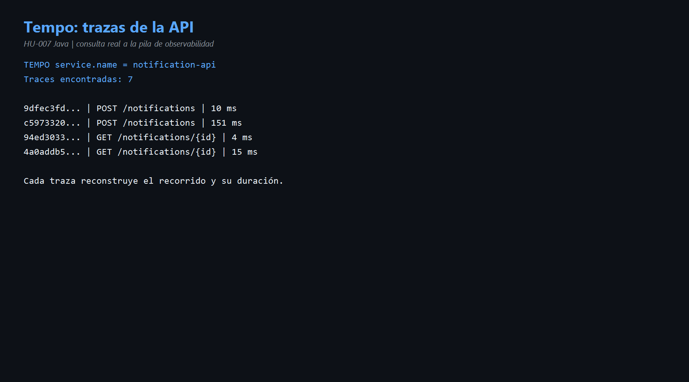
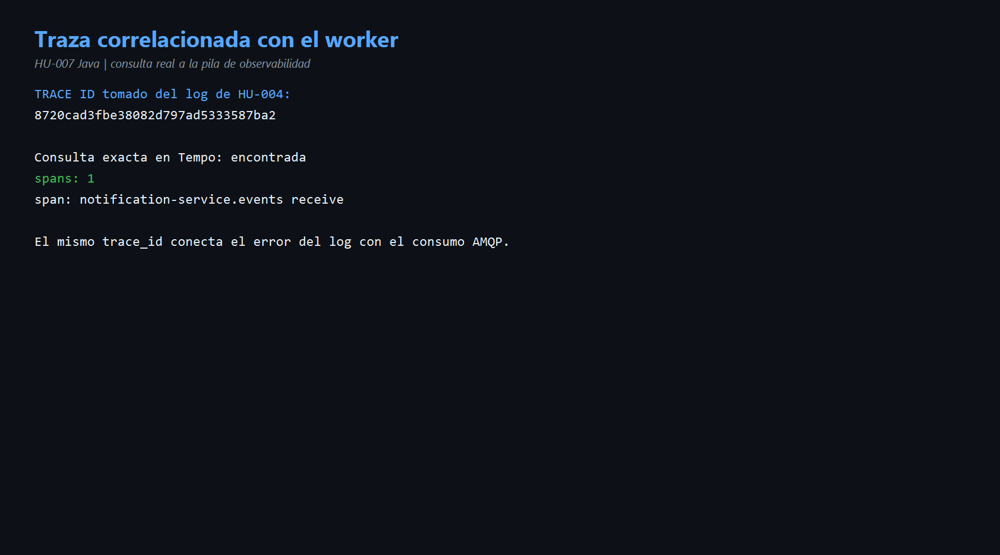
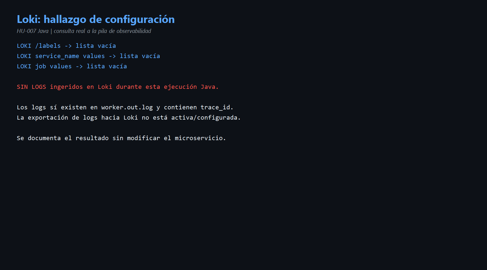

# HU-007 — Observabilidad (Java)

## Objetivo

Comprobar señales de salud, métricas, trazas y logs de la API y el worker Java, explicando qué responde cada señal y documentando las ausencias reales.

## Conceptos

| Señal | Pregunta que responde | Herramienta local |
|---|---|---|
| Health/readiness | ¿Está vivo y puede trabajar? | Endpoints `/health` y `/ready`. |
| Métricas | ¿Cuántas operaciones ocurrieron y con qué resultado? | Prometheus + Grafana. |
| Trazas | ¿Por qué componentes pasó una operación y cuánto tardó? | Tempo + Grafana. |
| Logs | ¿Qué explicó el proceso sobre un evento concreto? | Salida estructurada; Loki si está conectado. |

## Código reconocido

- [`application.yaml`](../codigo/notification-service/src/main/resources/application.yaml): configuración general y observabilidad de Spring.
- [`HealthController.java`](../codigo/notification-service/src/main/java/com/sena/notification_service/adapter/in/health/HealthController.java): liveness y readiness.
- [`CompositeNotifier.java`](../codigo/notification-service/src/main/java/com/sena/notification_service/adapter/out/notifier/CompositeNotifier.java) líneas 33-35: métrica `notification.delivered`.
- [`DomainEventConsumer.java`](../codigo/notification-service/src/main/java/com/sena/notification_service/adapter/in/amqp/DomainEventConsumer.java) líneas 68-79: propagación `traceparent`.
- [`OutboxRelay.java`](../codigo/notification-service/src/main/java/com/sena/notification_service/adapter/out/messaging/OutboxRelay.java): trazas del relay y propagación.

## Salud comprobada

- API `28081`: health `ok`; ready con base de datos `true`.
- Worker `28082`: health `ok`; ready con broker y base de datos `true`.

## Métricas encontradas en Prometheus

La API exportó siete series HTTP. Ejemplos reales:

```text
GET  /health              200 → 3
GET  /notifications/{id} 200 → 3
POST /notifications      202 → 4
POST /notifications      400 → 1
```

El worker mostró:

```text
notification_delivered_total{channel="EMAIL",status="SENT"} = 2
rabbitmq_consumed_total = 4
```

Estas métricas permiten medir tráfico, errores y entregas sin leer cada registro individual.

## Trazas encontradas en Tempo

Tempo encontró 7 trazas recientes de `notification-api`, incluyendo POST y GET con duraciones entre 4 ms y 308 ms. También encontró trazas del worker y del relay de Outbox.

El log del evento no soportado contenía el trace ID:

```text
8720cad3fbe38082d797ad5333587ba2
```

Al consultarlo directamente en Tempo apareció el span:

```text
notification-service.events receive
```

Esto demuestra correlación: el identificador visto en el log permite abrir la traza exacta del consumo AMQP.

## Hallazgo de logs

Loki respondió con listas vacías para labels, `service_name` y `job`. Por tanto, durante esta ejecución Java no hubo logs ingeridos en Loki. Los logs sí existen en los archivos de salida del proceso y contienen trace/span IDs, pero no están llegando al backend centralizado.

El resultado se conserva tal como fue observado. No se modificó la configuración del microservicio.

## Evidencias

- [Comandos reproducibles](comandos.md)
- [Diagrama de observabilidad](diagramas/observabilidad-hu-007.md)








## Mejora propuesta

Configurar explícitamente la exportación de logs Java al collector y verificar su envío a Loki. Los logs deberían ser JSON y contener al menos `service`, `level`, `event_id`, `notification_id`, `trace_id` y `span_id`.

También conviene crear un dashboard con tasa de solicitudes, errores HTTP, entregas por canal, latencia, consumo RabbitMQ y pendientes de Outbox.

## Conclusión para la exposición

> Observabilidad combina cuatro señales. Health y ready muestran disponibilidad; Prometheus confirmó solicitudes, entregas y consumos; Tempo permitió ver las trazas y correlacionar un error con el span de RabbitMQ. Loki no recibió logs en esta ejecución, aunque el proceso sí los produjo localmente. Ese vacío es un hallazgo y la mejora es conectar la exportación de logs al collector.
