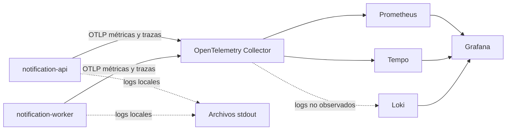

# Diagrama — observabilidad Java

## Lectura

- La línea continua representa señales verificadas.
- La línea punteada hacia Loki representa el vacío encontrado.
- Grafana funciona como interfaz de consulta; no almacena por sí mismo las señales.
