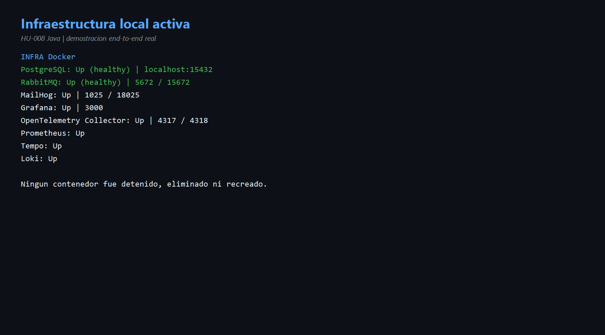
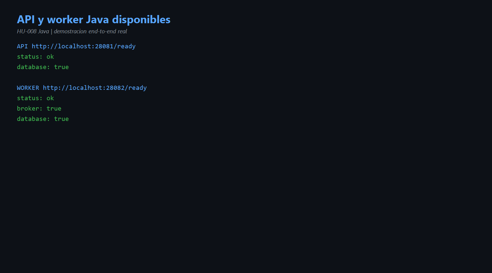
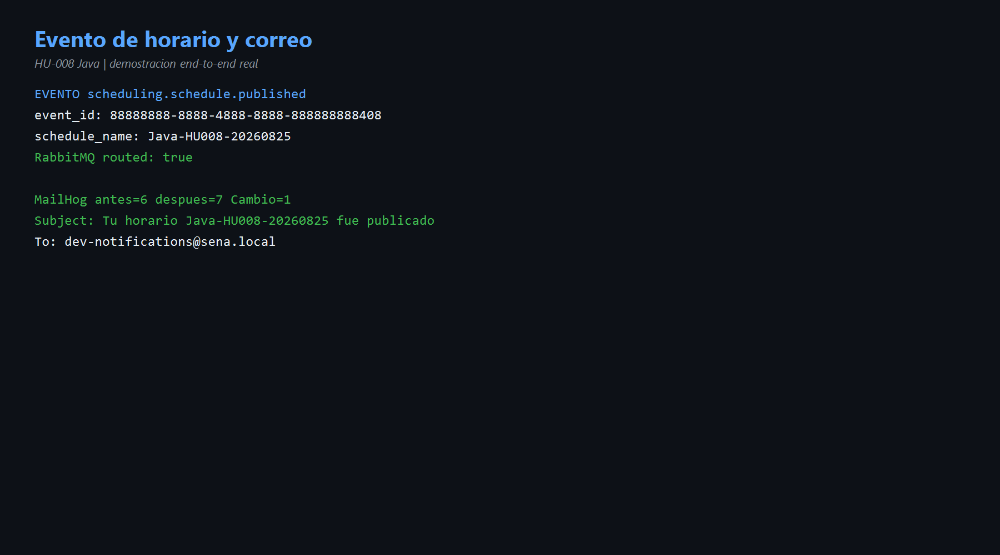
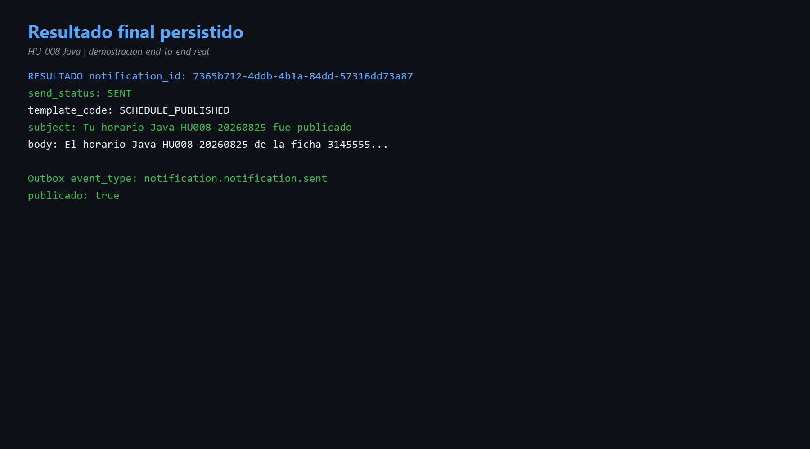

# HU-008 — Ejecución local end-to-end (Java)

## Objetivo

Demostrar desde el equipo local que la implementación Java y toda su infraestructura colaboran en un recorrido completo, sin modificar el código ni recrear contenedores.

## Qué significa end-to-end

No se comprueba solo un método. Se inicia desde un evento externo y se verifica cada resultado observable hasta el final:

```text
RabbitMQ → worker Java → regla de negocio → plantilla → SMTP/MailHog
         → PostgreSQL + Outbox → publicación → observabilidad
```

## Entorno ejecutado

| Componente | Dirección o puerto | Estado observado |
|---|---|---|
| API Java | `http://localhost:28081` | health y ready correctos. |
| Worker Java | `http://localhost:28082` | broker y database correctos. |
| PostgreSQL | `localhost:15432` | contenedor healthy. |
| RabbitMQ | `5672`, interfaz `15672` | contenedor healthy. |
| MailHog | SMTP `1025`, interfaz `18025` | activo. |
| Grafana | `http://localhost:3000` | activo. |
| OTEL Collector | `4317` y `4318` | activo. |
| Prometheus, Tempo y Loki | red Docker | activos. |

Se usaron puertos Java alternos para convivir con Go. Ningún contenedor fue detenido, eliminado o recreado.

## Evento de demostración

```json
{
  "event_id": "88888888-8888-4888-8888-888888888408",
  "event_type": "scheduling.schedule.published",
  "source_service": "scheduling-service-java-demo",
  "payload": {
    "published_by": "99999999-9999-4999-8999-999999999409",
    "schedule_name": "Java-HU008-20260825",
    "ficha": "3145555"
  }
}
```

RabbitMQ respondió:

```json
{"routed": true}
```

## Resultados reales

- El worker consumió el evento desde `notification-service.events`.
- Aplicó la plantilla `SCHEDULE_PUBLISHED`.
- MailHog aumentó de 6 a 7 mensajes.
- Asunto: `Tu horario Java-HU008-20260825 fue publicado`.
- Destino ficticio: `dev-notifications@sena.local`.
- PostgreSQL creó `7365b712-4ddb-4b1a-84dd-57316dd73a87`.
- Estado final: `SENT`.
- Cuerpo renderizado con horario y ficha.
- Outbox creó `notification.notification.sent`.
- `published_at` quedó informado.
- Prometheus y Tempo mostraron señales de API y worker.

## Qué demuestra cada comprobación

| Evidencia | Demostración |
|---|---|
| `routed:true` | El exchange encontró un binding compatible. |
| Cola en cero | El consumidor procesó y confirmó el mensaje. |
| Correo en MailHog | El adaptador SMTP se ejecutó. |
| Estado `SENT` | El resultado quedó persistido. |
| Outbox publicado | El evento de salida no se perdió después de la transacción. |
| Métricas y trazas | El recorrido puede observarse y diagnosticarse. |

## Evidencias

- [Comandos de laboratorio](comandos.md)
- [Diagrama end-to-end](diagramas/end-to-end-hu-008.md)









## Mejora propuesta

Crear un script oficial de demostración para Windows que valide prerrequisitos, seleccione puertos libres, inicie API y worker, publique un evento único y muestre automáticamente los enlaces de RabbitMQ, MailHog y Grafana. Debe ocultar credenciales y detener solo los procesos Java iniciados por el propio script.

## Conclusión para la exposición

> En HU-008 ejecuté el microservicio completo. La infraestructura ya estaba activa; inicié API y worker Java en puertos alternos, verifiqué sus dependencias y publiqué scheduling.schedule.published. RabbitMQ lo enrutó, el worker aplicó SCHEDULE_PUBLISHED, MailHog recibió el correo, PostgreSQL guardó SENT y Outbox publicó notification.notification.sent. Así confirmé la integración end-to-end sin cambiar código ni tocar los contenedores.
