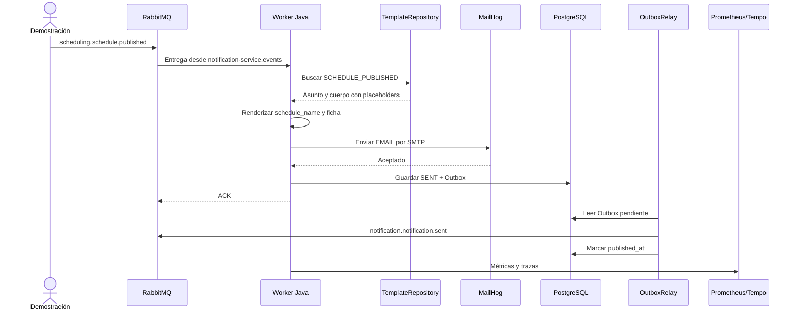

# Diagrama end-to-end — Java

```mermaid
sequenceDiagram
    actor Demo as Demostración
    participant R as RabbitMQ
    participant W as Worker Java
    participant T as TemplateRepository
    participant M as MailHog
    participant DB as PostgreSQL
    participant O as OutboxRelay
    participant OBS as Prometheus/Tempo

    Demo->>R: scheduling.schedule.published
    R->>W: Entrega desde notification-service.events
    W->>T: Buscar SCHEDULE_PUBLISHED
    T-->>W: Asunto y cuerpo con placeholders
    W->>W: Renderizar schedule_name y ficha
    W->>M: Enviar EMAIL por SMTP
    M-->>W: Aceptado
    W->>DB: Guardar SENT + Outbox
    W-->>R: ACK
    O->>DB: Leer Outbox pendiente
    O->>R: notification.notification.sent
    O->>DB: Marcar published_at
    W->>OBS: Métricas y trazas
```

El flujo contiene entrada asíncrona, lógica de negocio, adaptadores de salida, transacción y observabilidad.
