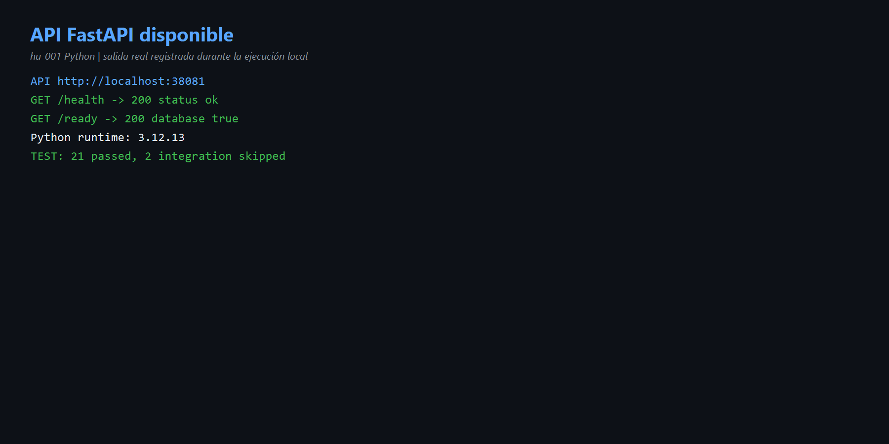
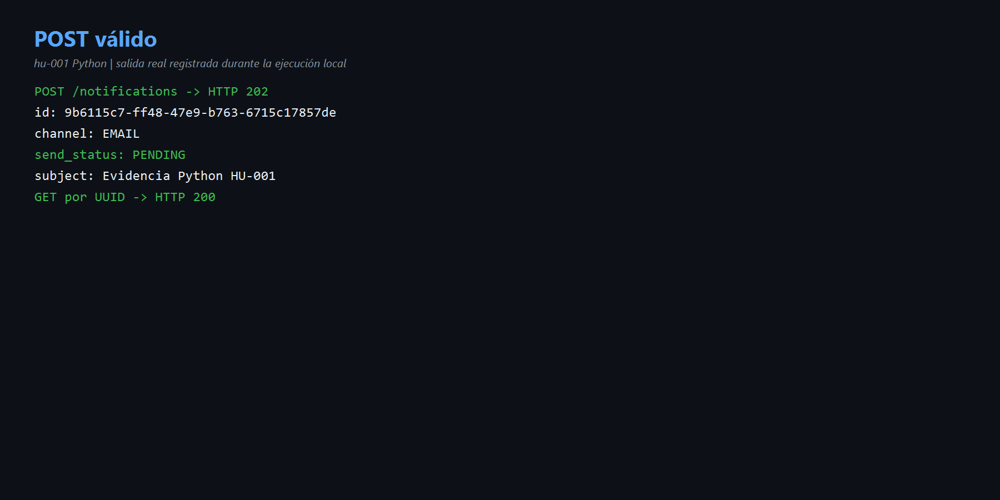
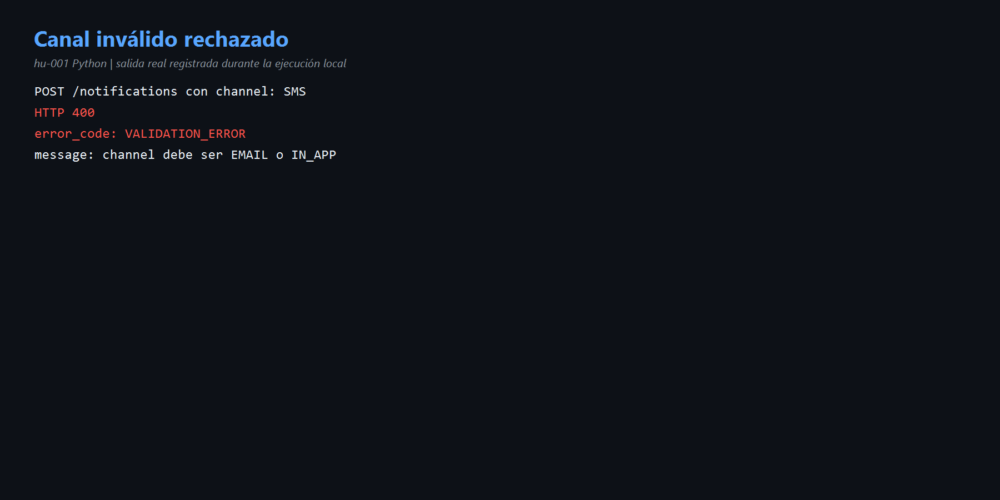

# HU-001 — Enviar notificación vía API (Python)

## Objetivo y comprensión

`POST /notifications` recibe JSON, FastAPI valida el contrato, el caso de uso crea una notificación `PENDING` y el repositorio Psycopg la guarda. Responde `202` porque acepta la solicitud, pero todavía no ejecuta la entrega.

```text
Cliente → FastAPI → SendNotification → Repository → PostgreSQL
```

## Código reconocido

- [`http.py`](../codigo/notification-service/app/adapters/inbound/http.py): rutas, validación y respuestas.
- [`use_cases.py`](../codigo/notification-service/app/application/use_cases.py): creación de la notificación.
- [`persistence.py`](../codigo/notification-service/app/adapters/outbound/persistence.py): INSERT en PostgreSQL.

## Ejecución real

- API: `http://localhost:38081`.
- `/health`: 200 `ok`.
- `/ready`: base de datos disponible.
- Suite: `21 passed`, `2 skipped` de integración por no recibir DSN en el runner aislado.
- POST válido: HTTP 202, UUID `9b6115c7-ff48-47e9-b763-6715c17857de`, `EMAIL/PENDING`.
- GET por UUID: HTTP 200.
- Canal `SMS`: HTTP 400, `VALIDATION_ERROR`.

## Evidencias

- [Comandos](comandos.md) · [Diagrama](diagramas/flujo.md)





## Mejora propuesta

Agregar `Location: /notifications/{id}` a la respuesta 202 e incluir `trace_id` en los errores.

## Para exponer

> HU-001 registra la intención de notificar. FastAPI valida, el caso de uso crea PENDING y Psycopg persiste. El 202 no significa que el correo ya fue entregado.
