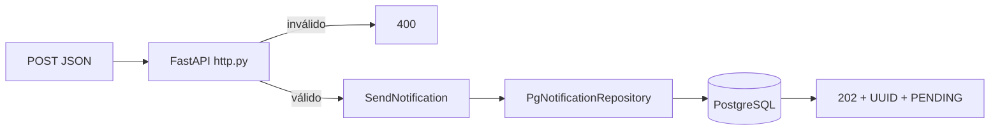

# Flujo HU-001 Python

```mermaid
flowchart LR
    A[POST JSON] --> B[FastAPI http.py]
    B -->|inválido| C[400]
    B -->|válido| D[SendNotification]
    D --> E[PgNotificationRepository]
    E --> F[(PostgreSQL)]
    F --> G[202 + UUID + PENDING]
```
