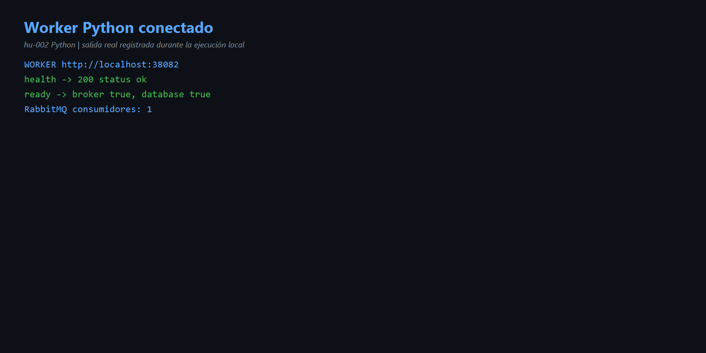
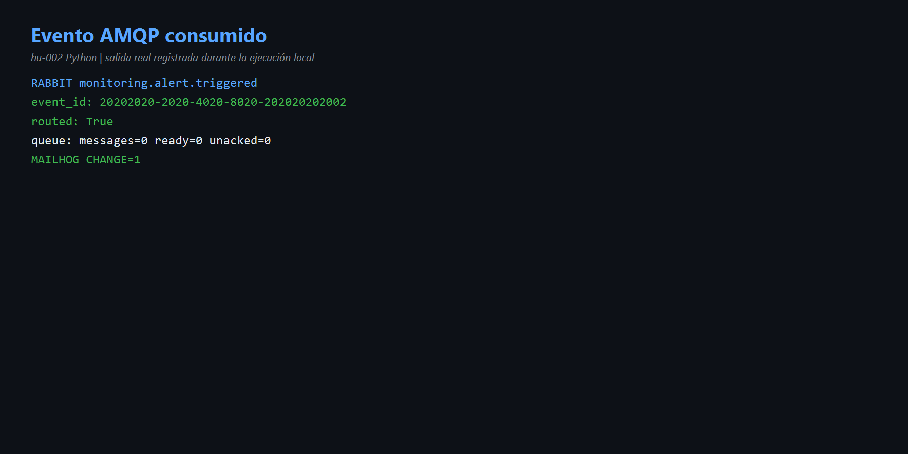
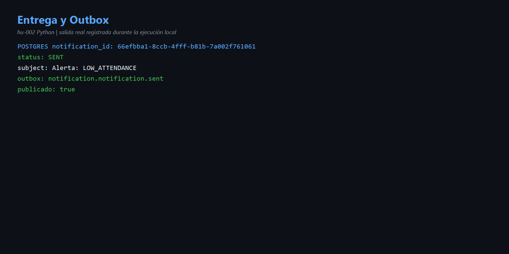

# HU-002 — Consumir eventos AMQP (Python)

## Objetivo y comprensión

El worker escucha `notification-service.events`. RabbitMQ enruta por routing key; Python valida el sobre, crea la notificación, aplica plantilla, envía SMTP, guarda `SENT` y crea Outbox. Finalmente hace ACK.

## Código reconocido

- [`amqp.py`](../codigo/notification-service/app/adapters/inbound/amqp.py): consumidor, ACK y NACK.
- [`use_cases.py`](../codigo/notification-service/app/application/use_cases.py): `ConsumeDomainEvent`.
- [`notifier.py`](../codigo/notification-service/app/adapters/outbound/notifier.py): EMAIL/IN_APP.
- [`messaging.py`](../codigo/notification-service/app/adapters/outbound/messaging.py): relay Outbox.

## Resultado real

- Worker `38082`: broker y database correctos.
- Un consumidor conectado.
- Evento `20202020-2020-4020-8020-202020202002` con `monitoring.alert.triggered`.
- RabbitMQ: `routed=True`; cola final `0/0/0`.
- MailHog: `+1`, asunto `Alerta: LOW_ATTENDANCE`.
- PostgreSQL: `66efbba1-8ccb-4fff-b81b-7a002f761061`, `SENT`.
- Outbox: `notification.notification.sent`, publicado.

## Evidencias

- [Comandos](comandos.md) · [Diagrama](diagramas/flujo.md)

## Mejora propuesta

Agregar DLQ y logs de éxito con `event_id`, `notification_id` y duración.

## Para exponer

> AMQP desacopla productor y consumidor. El exchange enruta, la cola conserva y el worker procesa; ACK explica por qué la cola vuelve a cero.
