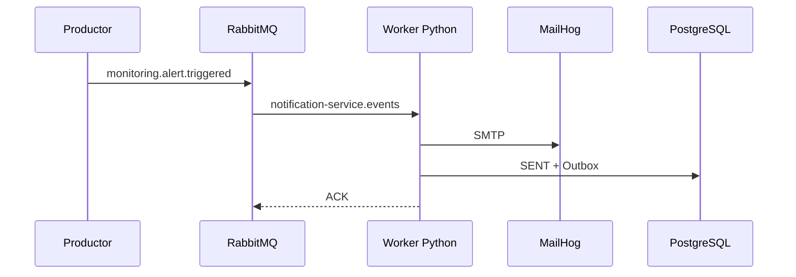

# Flujo HU-002 Python

```mermaid
sequenceDiagram
    participant P as Productor
    participant R as RabbitMQ
    participant W as Worker Python
    participant M as MailHog
    participant DB as PostgreSQL
    P->>R: monitoring.alert.triggered
    R->>W: notification-service.events
    W->>M: SMTP
    W->>DB: SENT + Outbox
    W-->>R: ACK
```
