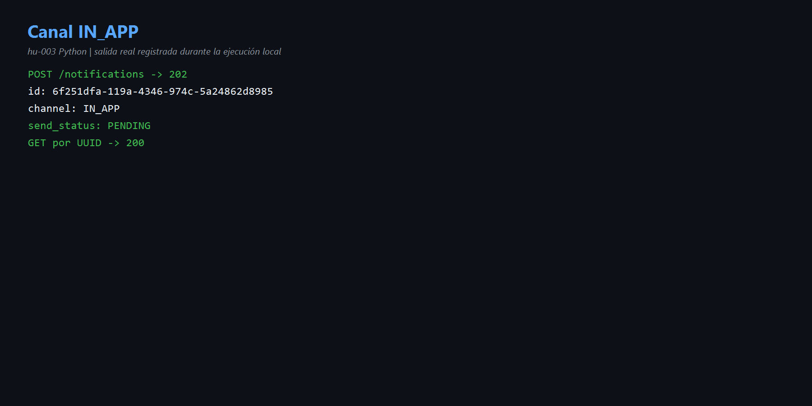
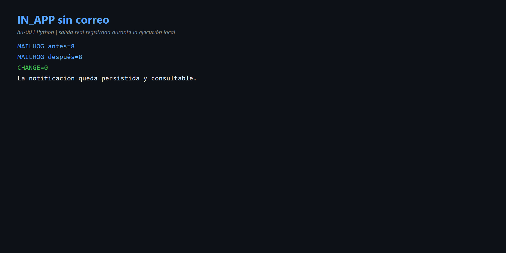
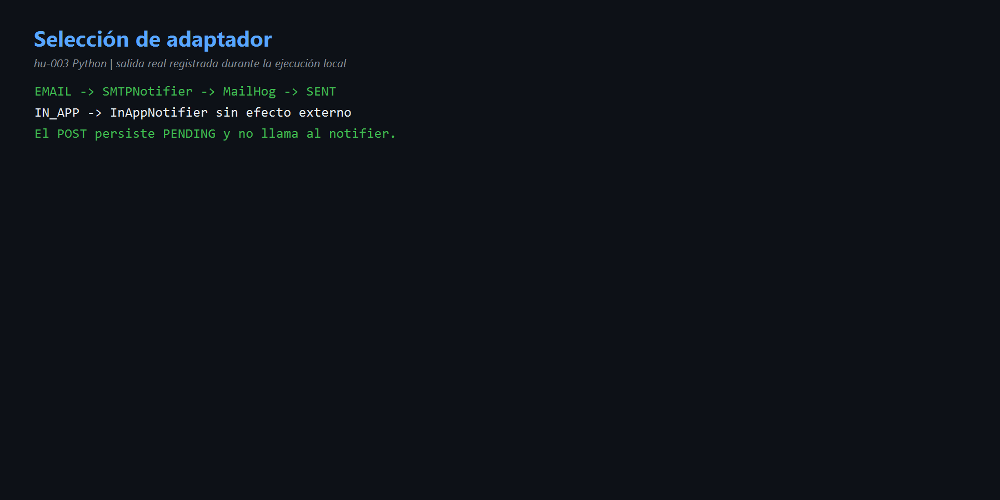

# HU-003 — Entrega por canales (Python)

## Comprensión

`CompositeNotifier` actúa como Strategy: `EMAIL` delega en SMTP y `IN_APP` en un adaptador sin efecto externo. El POST acepta ambos, pero solo persiste `PENDING`; el consumidor AMQP fija actualmente `EMAIL`.

## Resultado real

- EMAIL quedó demostrado en HU-002: MailHog + `SENT`.
- IN_APP: POST 202, UUID `6f251dfa-119a-4346-974c-5a24862d8985`, estado `PENDING`.
- GET: 200 con los mismos datos.
- MailHog antes 8, después 8, cambio 0.

Código: [`notifier.py`](../codigo/notification-service/app/adapters/outbound/notifier.py) y [`use_cases.py`](../codigo/notification-service/app/application/use_cases.py).

## Evidencias

- [Comandos](comandos.md) · [Diagrama](diagramas/canales.md)

## Mejora propuesta

Unificar la entrega asíncrona y actualizar IN_APP a `SENT` cuando quede disponible. El canal debe provenir de preferencias, no estar fijado en EMAIL.

## Para exponer

> EMAIL tiene efecto SMTP; IN_APP queda como registro consultable. El hallazgo es que el flujo IN_APP completo hasta SENT aún no está conectado.
