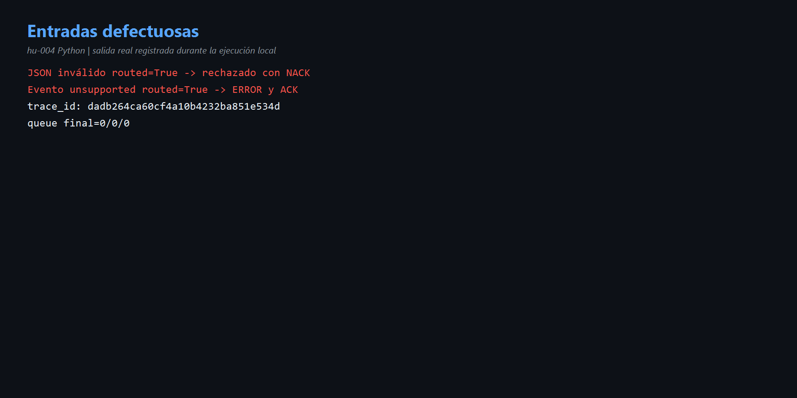
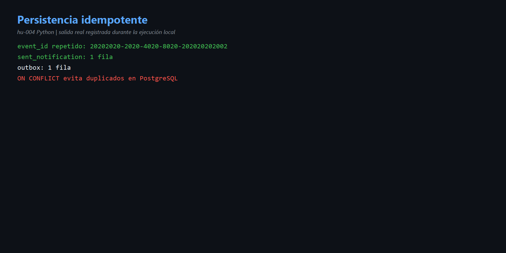

# HU-004 — Resiliencia e idempotencia (Python)

## Comprensión

Python conserva la semántica original: sobre inválido recibe NACK sin requeue; error de negocio se registra y recibe ACK; PostgreSQL deduplica por `source_event_id`. No hay retry/backoff/DLQ observados.

## Pruebas reales

- Texto no JSON: `routed=True`, warning `rejecting invalid envelope`, cola cero.
- Evento `monitoring.event.unsupported`: error con trace ID `dadb264ca60cf4a10b4232ba851e534d`, después ACK.
- Evento repetido `20202020-2020-4020-8020-202020202002`:
  - notificación: 1 fila;
  - Outbox: 1 fila;
  - MailHog: 8 → 9, un correo adicional.

La persistencia es idempotente, pero SMTP no, porque el envío sucede antes de detectar el conflicto.

Código: [`amqp.py`](../codigo/notification-service/app/adapters/inbound/amqp.py), [`use_cases.py`](../codigo/notification-service/app/application/use_cases.py) y [`persistence.py`](../codigo/notification-service/app/adapters/outbound/persistence.py).

## Evidencias

- [Comandos](comandos.md) · [Diagrama](diagramas/resiliencia.md)

## Mejora propuesta

Implementar retry con backoff y DLQ; reservar `source_event_id` antes del envío SMTP.

## Para exponer

> El worker continúa vivo, pero descarta sin reintento. La base no duplica filas; el correo sí se duplica. Idempotencia debe cubrir también efectos externos.
