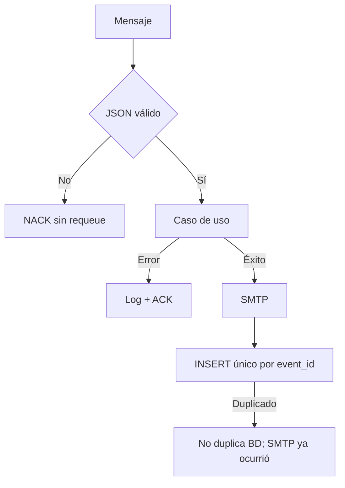

# Resiliencia Python

```mermaid
flowchart TD
    A[Mensaje] --> B{JSON válido}
    B -->|No| C[NACK sin requeue]
    B -->|Sí| D[Caso de uso]
    D -->|Error| E[Log + ACK]
    D -->|Éxito| F[SMTP]
    F --> G[INSERT único por event_id]
    G -->|Duplicado| H[No duplica BD; SMTP ya ocurrió]
```
