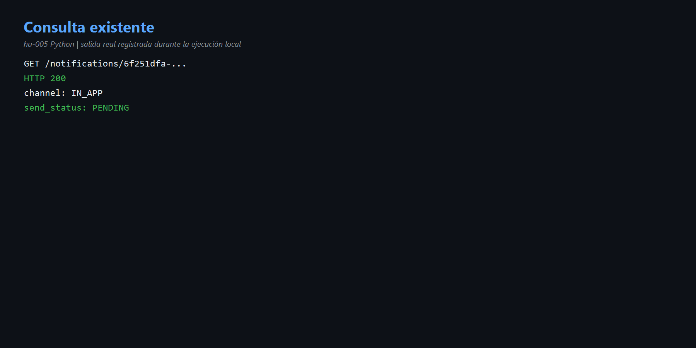
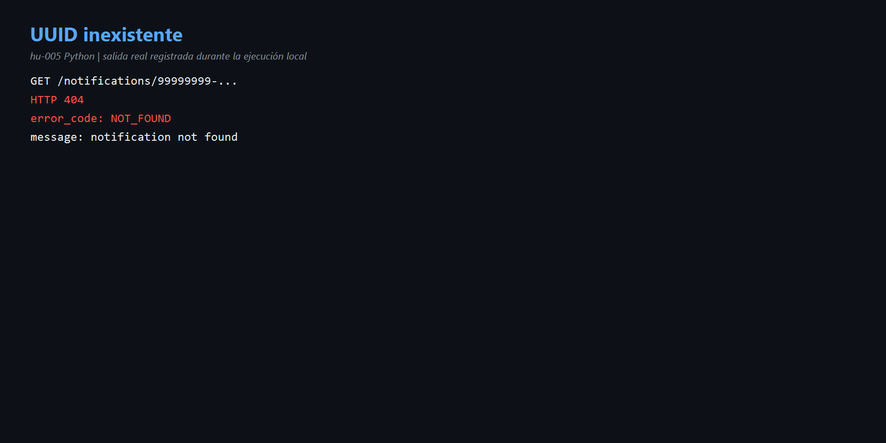
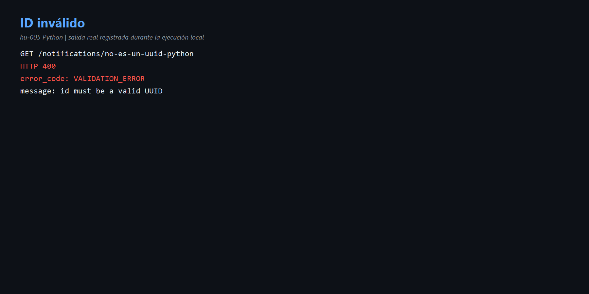

# HU-005 — Consultar notificaciones (Python)

## Comprensión

FastAPI valida el identificador y el caso de uso consulta Psycopg. Las respuestas distinguen formato inválido, ausencia y recurso encontrado.

| Caso real | Resultado |
|---|---|
| `6f251dfa-119a-4346-974c-5a24862d8985` | 200, `IN_APP/PENDING`. |
| `99999999-9999-4999-8999-999999999996` | 404 `NOT_FOUND`. |
| `no-es-un-uuid-python` | 400 `VALIDATION_ERROR`. |

Código: [`http.py`](../codigo/notification-service/app/adapters/inbound/http.py), [`use_cases.py`](../codigo/notification-service/app/application/use_cases.py) y [`persistence.py`](../codigo/notification-service/app/adapters/outbound/persistence.py).

## Evidencias

- [Comandos](comandos.md) · [Diagrama](diagramas/consulta.md)

## Mejora propuesta

Devolver también `created_at`, `sent_at` y `failure_reason`.

## Para exponer

> 400 significa que el ID no sirve como UUID; 404 que sí es UUID pero no existe; 200 que el recurso fue encontrado.
