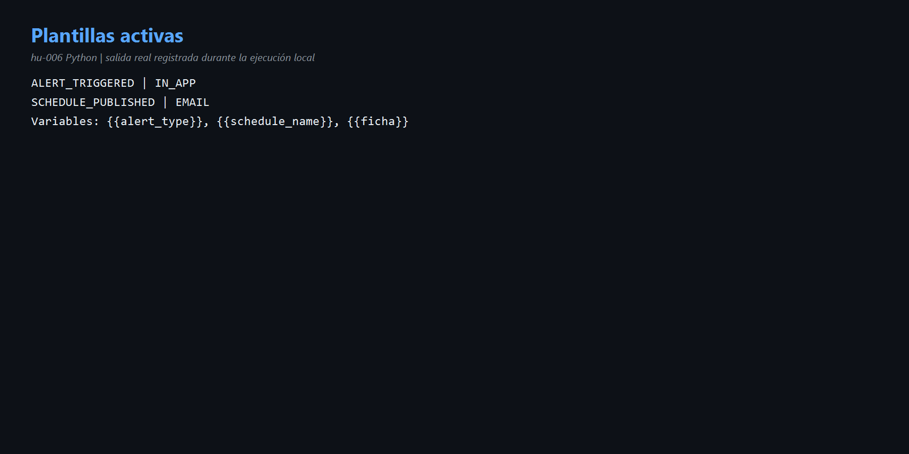
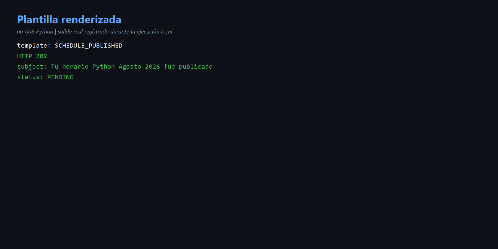
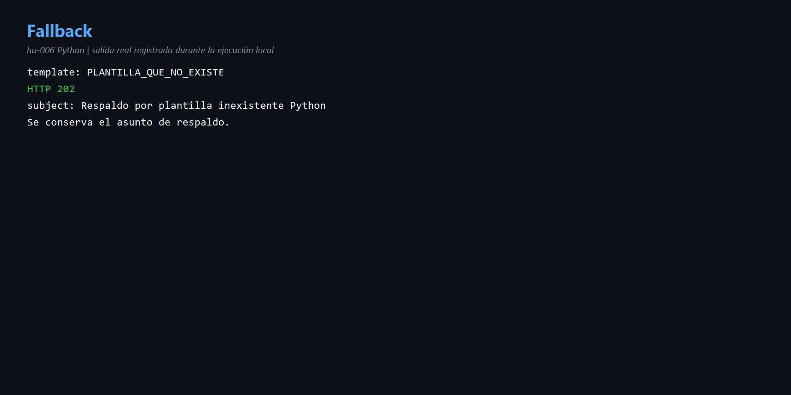

# HU-006 — Plantillas (Python)

## Comprensión

PostgreSQL almacena asunto y cuerpo con placeholders. El caso de uso busca por `template_code` y el servicio de dominio sustituye `template_vars`.

Plantillas activas: `ALERT_TRIGGERED` y `SCHEDULE_PUBLISHED`.

## Resultados

- `SCHEDULE_PUBLISHED` + `schedule_name=Python-Agosto-2026` → HTTP 202 y asunto `Tu horario Python-Agosto-2026 fue publicado`.
- `PLANTILLA_QUE_NO_EXISTE` → HTTP 202 y asunto de respaldo `Respaldo por plantilla inexistente Python`.

Código: [`use_cases.py`](../codigo/notification-service/app/application/use_cases.py), [`services.py`](../codigo/notification-service/app/domain/services.py) y [`persistence.py`](../codigo/notification-service/app/adapters/outbound/persistence.py).

## Evidencias

- [Comandos](comandos.md) · [Diagrama](diagramas/plantillas.md)

## Mejora propuesta

Distinguir plantilla inexistente de fallo de base de datos y validar variables obligatorias.

## Para exponer

> La plantilla separa contenido y código. Python sustituye variables; si no encuentra el código conserva el asunto de respaldo.
