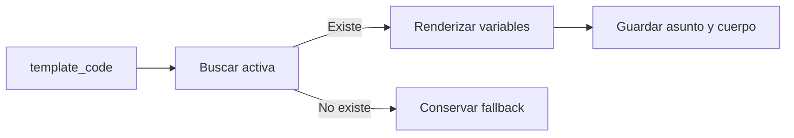

# Plantillas Python

```mermaid
flowchart LR
    A[template_code] --> B[Buscar activa]
    B -->|Existe| C[Renderizar variables]
    C --> D[Guardar asunto y cuerpo]
    B -->|No existe| E[Conservar fallback]
```
