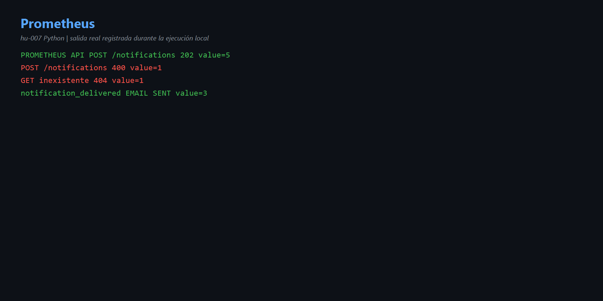
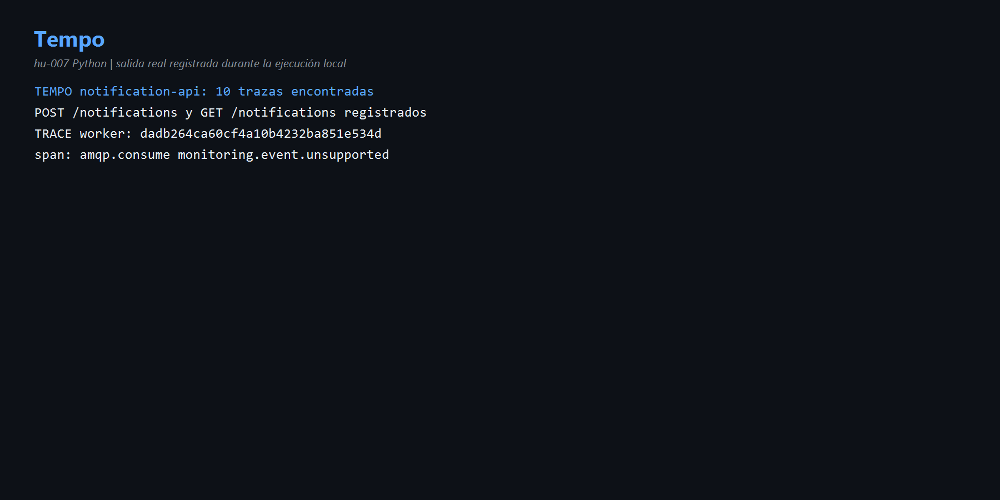
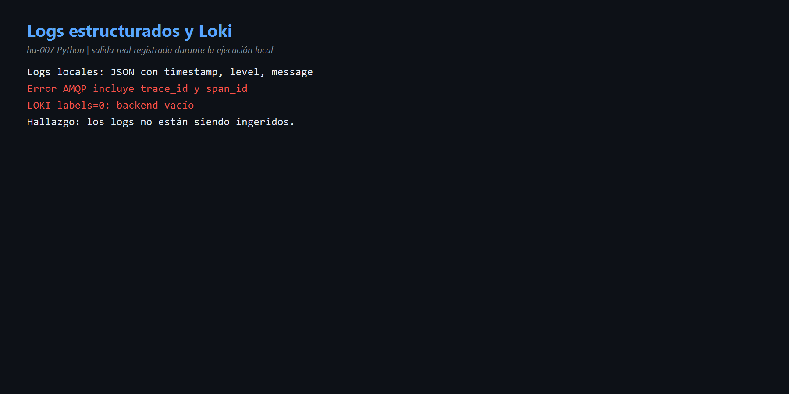

# HU-007 — Observabilidad (Python)

## Señales

- Health/readiness: disponibilidad y dependencias.
- Métricas: cantidades y estados en Prometheus.
- Trazas: recorrido y duración en Tempo.
- Logs: explicación estructurada de eventos; Loki debería centralizarlos.

## Resultados reales

Prometheus registró `http_server_requests_total`, incluyendo POST 202 = 5, POST 400 = 1, GET 404 = 1; el worker registró `notification_delivered_total{EMAIL,SENT}=3`.

Tempo encontró 10 trazas de `notification-api`. El error AMQP se correlacionó con trace ID `dadb264ca60cf4a10b4232ba851e534d` y span `amqp.consume monitoring.event.unsupported`.

Los logs locales son JSON y contienen `trace_id`/`span_id`, pero Loki devolvió `labels=0`: no hubo ingestión. Es un hallazgo, no se cambió el código.

Código: [`telemetry.py`](../codigo/notification-service/app/platform/telemetry.py), [`logging.py`](../codigo/notification-service/app/platform/logging.py) y [`http.py`](../codigo/notification-service/app/adapters/inbound/http.py).

## Evidencias

- [Comandos](comandos.md) · [Diagrama](diagramas/observabilidad.md)

## Mejora propuesta

Enviar los logs JSON al collector/Loki y crear dashboards de errores, latencia, entregas y profundidad de cola.

## Para exponer

> Prometheus dice cuánto ocurrió, Tempo muestra el recorrido y el log explica el error. Loki vacío revela que falta centralizar los logs Python.
