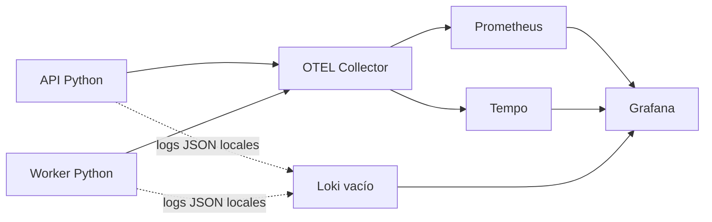

# Observabilidad Python

```mermaid
flowchart LR
    A[API Python] --> C[OTEL Collector]
    W[Worker Python] --> C
    C --> P[Prometheus]
    C --> T[Tempo]
    A -. logs JSON locales .-> L[Loki vacío]
    W -. logs JSON locales .-> L
    P --> G[Grafana]
    T --> G
    L --> G
```
