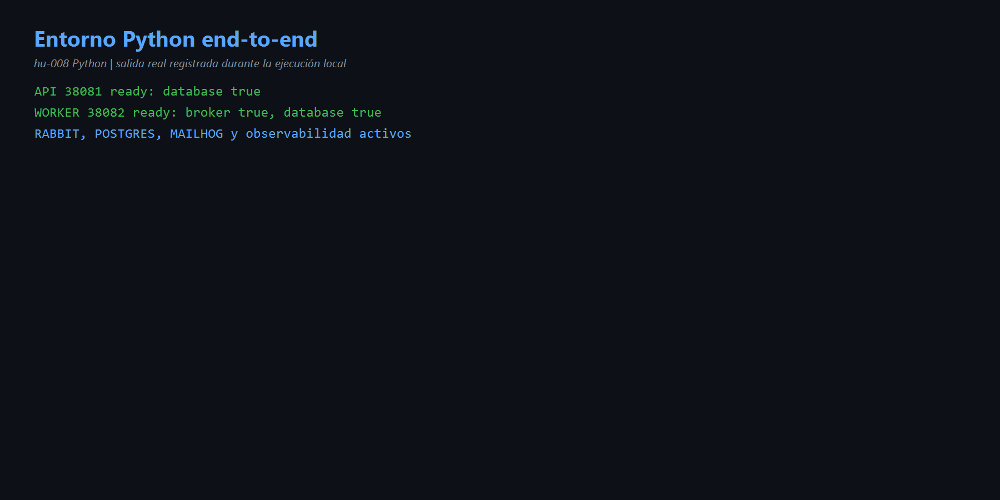
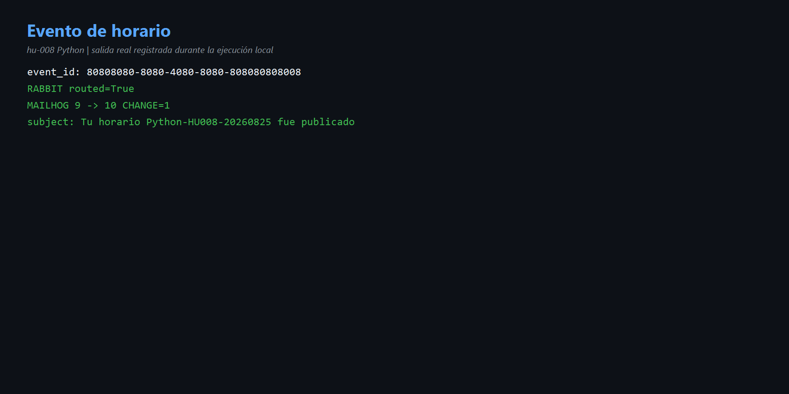
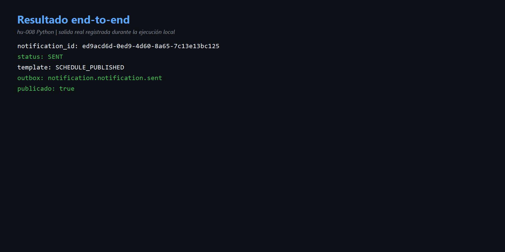

# HU-008 — Ejecución local end-to-end (Python)

## Objetivo

Demostrar la cadena completa con API/worker Python y la infraestructura existente.

## Entorno

- API `38081`: database true.
- Worker `38082`: broker y database true.
- PostgreSQL, RabbitMQ, MailHog, Grafana, collector, Prometheus, Tempo y Loki activos.
- Python temporal 3.12.13; el proyecto declara >=3.13. Las 21 pruebas ejecutadas pasaron.
- Código intacto; contenedores sin cambios.

## Evento y resultado

Evento `scheduling.schedule.published`, ID `80808080-8080-4080-8080-808080808008`, horario `Python-HU008-20260825`.

- RabbitMQ: `routed=True`.
- MailHog: 9 → 10, asunto renderizado.
- PostgreSQL: `ed9acd6d-0ed9-4d60-8a65-7c13e13bc125`, `SENT`.
- Plantilla: `SCHEDULE_PUBLISHED`.
- Outbox: `notification.notification.sent`, publicado.

```text
RabbitMQ → Worker Python → plantilla → SMTP/MailHog
         → PostgreSQL + Outbox → Prometheus/Tempo
```

## Evidencias

- [Comandos](comandos.md) · [Diagrama](diagramas/end-to-end.md)





## Mejora propuesta

Proporcionar un script oficial que cree un entorno corto, valide Python 3.13, inicie perfiles en puertos libres y ejecute automáticamente la demostración.

## Para exponer

> HU-008 prueba integración real: evento en RabbitMQ, consumo Python, plantilla, correo, SENT, Outbox y observabilidad; no se modificó código.
