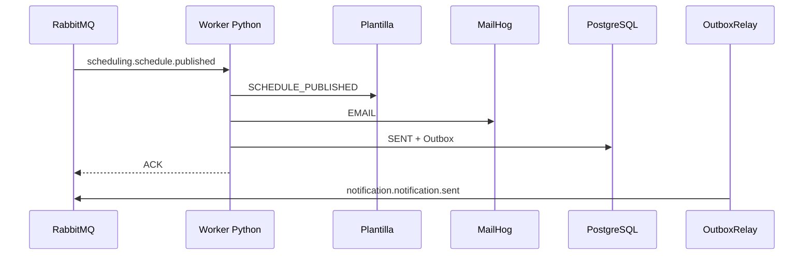

# End-to-end Python

```mermaid
sequenceDiagram
    participant R as RabbitMQ
    participant W as Worker Python
    participant T as Plantilla
    participant M as MailHog
    participant DB as PostgreSQL
    participant O as OutboxRelay
    R->>W: scheduling.schedule.published
    W->>T: SCHEDULE_PUBLISHED
    W->>M: EMAIL
    W->>DB: SENT + Outbox
    W-->>R: ACK
    O->>R: notification.notification.sent
```
